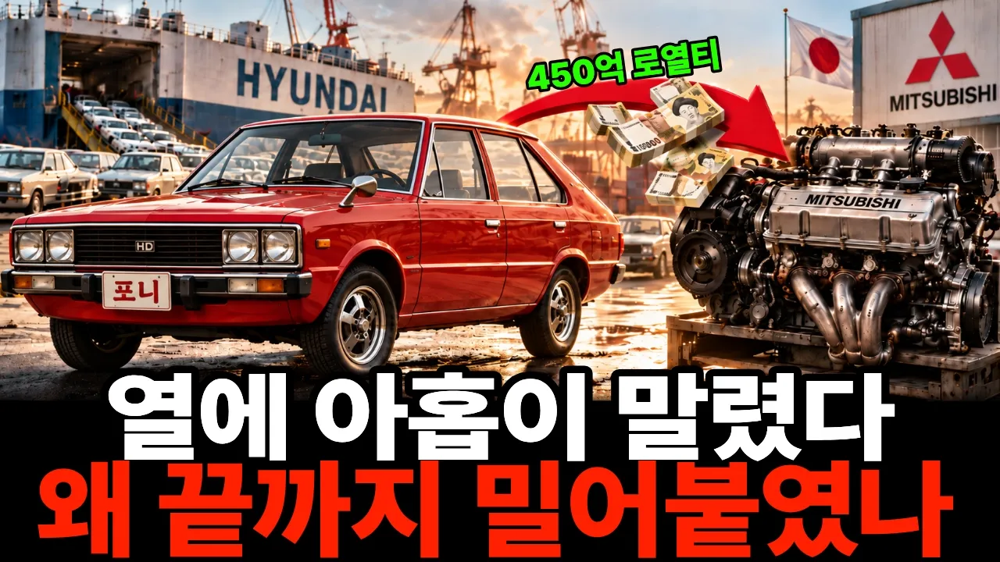

# “차를 팔수록 일본에 돈을 냈습니다” 450억 로열티를 내던 현대가 끝내 돈의 방향을 뒤집은 이유

## 기본 정보
- **URL**: https://www.youtube.com/watch?v=Ag-sCApP9Po
- **채널명**: 탁경제
- **구독자수**: 1,670
- **조회수**: 35,127
- **업로드일**: 2026-09-18
- **영상 길이**: 22:30
- **댓글 수**: 18
- **좋아요 수**: 66

## 썸네일

---

## 댓글 (추천순 TOP 10)

| 순위 | 좋아요 | 댓글 |
|------|--------|------|
| 1 | 1 | "당신들은 대체 무엇 때문에 사는 겁니까? 살기 위해 일하는 건지  일하기 위해 사는 건지 알 수가 없군요..  한국 기술자들은 정말 대단합니다. 하루가 마치 25시간인 듯 일하고 있으니 머지않아 당신들은 우리 영국 자동차를 앞지르게 될 거요." 영국 기술자 |
| 2 | 1 | 새로운 얘기네요. 감사합니다❤ |
| 3 | 0 | 감사합니다. 뻔한 얘기일 수 있지만 여러 관점에서 다양하게 생각해보고 즐길 수 있도록 열심히 하겠습니다😊😊 |
| 4 | 1 | 잘 봤습니다!! |
| 5 | 0 | 감사합니다😊 |
| 6 | 2 | 왜 자율주행은 포기 하지 않습니까 ? 불안한 기술은 시간 낭비 입니다. 제발 빨리 포기 하고 안전, 디자인에 집중 투자 하십시요. |
| 7 | 3 | 안녕하세요. 의견 감사합 니다. 근데 자율주행을 포기 하는 건 시대의 역행 아닌가요? 혼란이야 있겠지만 우린 언제나처럼 해결해 나갈 거고요😊 우려의 말씀 충분히 이해가지만 이건 그냥 자연스럽게 가야할 길이라 생각이 듭니다😮 |
| 8 | 1 | 목숨 걸고 새 엔진 개발 지시  한  오너와 주주들. 거기서 열린 열매를 아무 리스크 도 짊어 지지 않은  차  조립공 들이  나누어 달란다. 도둑놈들. |
| 9 | 0 | 큰 위험을 감수한 결단도 대단하지만, 그걸 실제 엔진으로 만들어낸 기술자들도 정말 대단하죠. 결국 둘이 함께 만든 결과라고 봅니다.^^ |
| 10 | 5 | 년 225억 원이 줄어드는 확실한 할인과, 실패하면 1,000억 원이 날아가는 엔진 개발. 1980년대 현대 사장 자리에 앉아 계셨다면 어느 쪽을 고르셨을까요? 그리고 1991년 스쿠프를 직접 몰아보신 분, 그 차 기억도 들려주세요.😁 |
