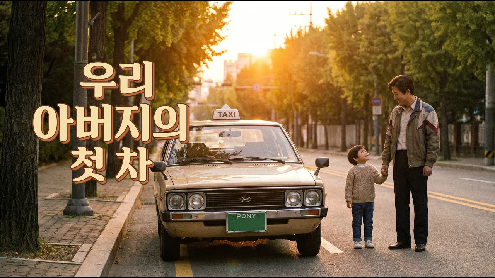

# 포니에서 소나타까지, 한국 자동차 70년사를 단 10분 만에 완벽 정리해 드립니다

## 기본 정보
- **URL**: https://www.youtube.com/watch?v=n_9EGZiJWno
- **채널명**: 시대를기억하다
- **구독자수**: 362
- **조회수**: 382
- **업로드일**: 2026-04-17
- **영상 길이**: 10:27
- **댓글 수**: 3
- **좋아요 수**: 8

## 썸네일

---

## 댓글 (추천순 TOP 10)

| 순위 | 좋아요 | 댓글 |
|------|--------|------|
| 1 | 2 | 드럼통 두드리던 '시발자동차'에서 독자 모델 '포니'까지! 🇰🇷  여러분에게 가장 기억에 남는 국산차는 무엇인가요? 추억을 나눠주세요! ✨ |
| 2 | 3 | 영화 택시 운전사에서 송강호가 몰던 차는 포니가 아니라 기아의 '브리샤'였어요. |
| 3 | 0 | 좋은 지적 감사합니다. 말씀해주신 것처럼 영화 ‘택시운전사’에서 택시운전사 속 송강호 배우가 몰던 차는 포니가 아니라 기아 브리사 기반 차량으로 보는 해석이 더 정확합니다. 영상에서는 당시 대중적으로 익숙한 이미지로 포니를 언급했는데, 실제 모델 구분까지 짚어주셔서 맥락을 더 풍부하게 볼 수 있네요. 결국 핵심은 70~80년대 한국 도로를 채웠던 국산차들의 시대상이었는데, 이런 디테일 덕분에 이야기의 깊이가 더 살아나는 것 같습니다. 앞으로도 이런 시선 많이 나눠주시면 감사드리겠습니다.^^ 감사합니다~ |
