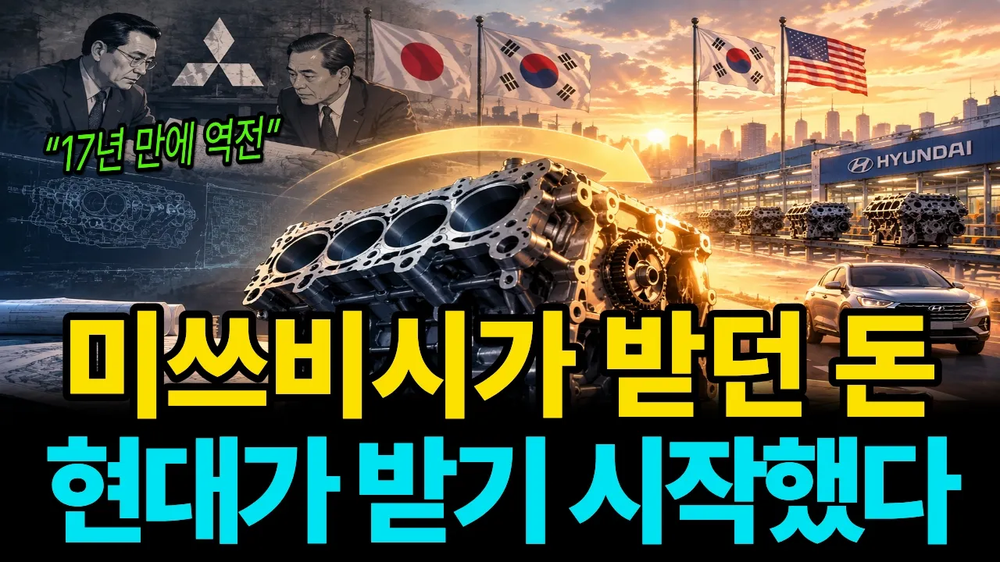

# "이 엔진, 누가 그렸습니까" 1988년 순이익의 절반을 일본에 보내던 현대가 쇳덩이 하나를 끝까지 뜯어본 이유

## 기본 정보
- **URL**: https://www.youtube.com/watch?v=jS1NVyPzGVA
- **채널명**: 경제디텍터
- **구독자수**: 1만
- **조회수**: 5,997
- **업로드일**: 2026-09-20
- **영상 길이**: 30:16
- **댓글 수**: 4
- **좋아요 수**: 17

## 썸네일

---

## 댓글 (추천순 TOP 10)

| 순위 | 좋아요 | 댓글 |
|------|--------|------|
| 1 | 1 | 2:30 |
| 2 | 0 | 2:30 구간은 도입부로, 1988년 현대의 순이익(약 800억)과 미쓰비시로 지급된 로열티(약 450억)를 비교하며, 차 한 대당 로열티가 어떻게 비용으로 빠져나갔는지 요약해 보여줍니다. |
| 3 | 0 | 그리다 자리 섭니다.  llm 식  직역체 한국말이 문제군요. |
| 4 | 0 | 지적 감사합니다. 전달을 우선하다 보니 직역투가 남을 수 있습니다. 말씀해주신 부분은 반영해 숫자와 맥락을 지키면서 표현을 더 다듬어 자연스러운 한국어로 정리하겠습니다. |
