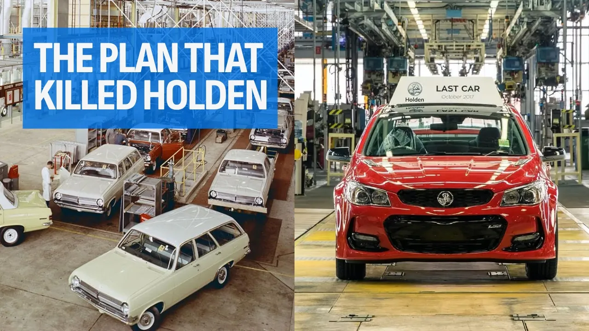

# How One Government Plan Destroyed Australia’s Car Industry

## 기본 정보
- **URL**: https://www.youtube.com/watch?v=-lu_0nAbQ_U
- **채널명**: carsales
- **구독자수**: 13만
- **조회수**: 81,986
- **업로드일**: 2026-08-09
- **영상 길이**: 9:24
- **댓글 수**: 224
- **좋아요 수**: 959

## 썸네일

---

## 댓글 (추천순 TOP 10)

| 순위 | 좋아요 | 댓글 |
|------|--------|------|
| 1 | 108 | The script is AI and/or sloppily researched. Mitsubishi bought out Chrysler Australia in October 1980, not 1978. Nissan stopped manufacturing cars in Australia in 1992, not 1994. Small points that don't affect the overall narrative, but stuff that you'd think a site like carsales should at least get right. |
| 2 | 15 | It also leaves out the fact that GMH manufactured fake losses so they could continue stealing subsidies from the Australian government. |
| 3 | 5 | yea this was just plain rubbish I downvotes as well - so many better researched videos on youtube about GM killing Holden |
| 4 | 5 | Yes I wondered the same about AI. The map of Australia used was very inaccurate. Indicating that the port Melbourne pub Holden and Toyota executives met in was in Adelaide, as well as indicating the Holden plant was somewhere south of the Mitsubishi plant, when Elizabeth is north of Tonsley. |
| 5 | 0 | CAL was sold to become MMAL to save Chrysler US, as CAL was the only arm of the company in profit, it was all they had that they could sell, and they sold it to a company they had history co-working with, right up until Benz got involved. The replacement for the Neon, Lancer, Excel and A-Class were planned to be a shared chassis, but Benz didn't want to work with Asian car makers. The AI also skipped all the companies that were building cars here from TKD kits - VW, Renault, Peugeot, etc, and not a single mention of Leyland Group, with the Mini's, 1800's or the P76. |
| 6 | 89 | Government ruined this by signing the Lima agreement, adopting globalisation and removing tariffs that helped build our country.  What most people fail to understand or completely ignores, as do most politicians and the public, is that car making is SO MUCH more than just car making.  It enhances and bolsters the wider engineering, technical and manufacturing capability of a country - as it did here in Australia.  A vehicle is a complex machine that draws on many skills and competencies.  Product design, CAD design, surface development, body, chassis & design, aero dynamics, powertrain etc... all require well trained and skilled people.  First, second and third tier suppliers also need this.  Thus, the collective ability to design and manufacture a car supports the wider design, engineering and manufacturing industry, from cars, trucks, tractors, white goods etc...… ALL of which were made in Australia at one time.  The loss of this industry will have wider consequences for the country than merely making cars.  Gone also are the factories, the machine tools and the skilled operators.  This will have a long term effect on Australia's ability to make anything.  Many will say we don't need to but I ask.  What happens in times of conflict?  What happens when shipping cost become very high? Where are the future generations to work?  Do you want Australia to be beholden to foreign countries for everything it needs?  I certainly don't.  For me, the industry is important and I think especially important for the country to have it running at full capacity and have our PM driving in an Australian made car.  There is a sense of pride that comes from making things, particularly something as complex and visible as a car.
 
 So answer me  this.  When, not if, Australia finds that the shipping lanes are disrupted due to conflict, political tension, energy costs, etc... and the arrival of goods to Australia or the leaving of our minerals cannot happen, what then?  How does one AI out of that?
 Australia is critically exposed to events outside our control for which we will suffer if we cannot be self reliant - like we once were.
 To be productive and prosperous we need to value add and produce things.  Simple.
  
 Banana republic - that is what Australia is today.  And instead of rebuilding our manufacturing we have a government and bureaucracy consumed with climate change and wealth 
 redistribution, stifling us all with regulation, taxes and petty identity politics.  Our government are an absolute disgrace and embarrassment. |
| 7 | 10 | Superbly constructed argument. As someone who worked my whole life with a vehicle importer I always valued and argued for a viable local automotive manufacturing base. As I’m Australian first. All your points are spot on. |
| 8 | 4 | Hear hear !!! |
| 9 | 5 | Excellent summation ... globalism mass immigration and free trade are just simply economic tools to strip nations of their sovereignty. Utilising post-war British Imperialist economics  the unelected beauracracy, with their  seat of power in the City of London, has achieved exactly what you laid out here.  President Trump is reinstating Hamiltonian economics and the American System by reshoring manufacturing jobs rebuilding the industrial base and implementing the tariffs. An example of his outreach was the $8 Billion deal to do high end rare earth mineral processing here on Australian shores ... rather than just ship out the raw minerals.  As they say we used to be a nation of people who fix things. Now we are just a nation of consumers. |
| 10 | 4 | As a side note ... Gough Whitlam attempted to reinstate Australia's sovereignty. He was promptly removed by the Governor General at the behest of the British globalists. |
