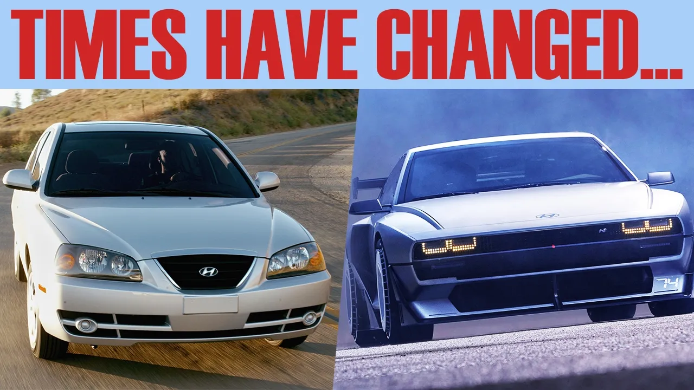

# How Hyundai did it

## 기본 정보
- **URL**: https://www.youtube.com/watch?v=QSRIya50v20
- **채널명**: The Drive
- **구독자수**: 197만
- **조회수**: 47,869
- **업로드일**: 2026-01-13
- **영상 길이**: 19:27
- **댓글 수**: 411
- **좋아요 수**: 2,348

## 썸네일

---

## 댓글 (추천순 TOP 10)

| 순위 | 좋아요 | 댓글 |
|------|--------|------|
| 1 | 188 | It is amazing how Hyundai and Nissan basically switched places |
| 2 | 16 | Exactly. I went from buying Nissans in the 90s, and 2000s to buying Hyundai in 2010s, 2020s |
| 3 | 4 | Revenge for 1905-45 |
| 4 | 140 | mass sell a bunch of economy cars. make profit. then you can get better engineering to make cooler stuff |
| 5 | 3 | 2010 Genesis Coupe 2.0T GT. Survived multiple trackday weekends. Long-haul road trips. 16 years later. No issues or complaints ... |
| 6 | 5 | Hyundai is one of those few car brandings that doesn't make boring cars nowadays |
| 7 | 46 | Back in the 90's, I borrowed a friends Hyundai in college for an errand.  It was only a couple years old at the time, but it felt like I borrowed something that was 15+ years.  The thing was pretty ragged.  It is night and day, when comparing the Hyundai's of the 90's vs today. |
| 8 | 54 | I want the N Vision 74 as a hybrid. That’s it. |
| 9 | 5 | This! I love the design, but making it a hydrogen car is a massive mistake. An EREV would be perfect |
| 10 | 2 | I've had nothing but Korean cars from HMG for 15 years now. That roster has included Santa Fe, Veloster, and Carnival. They've been very reliable and the Veloster was just wildly fun. The Santa Fe and Carnival both have V6s that are super reliable. |
