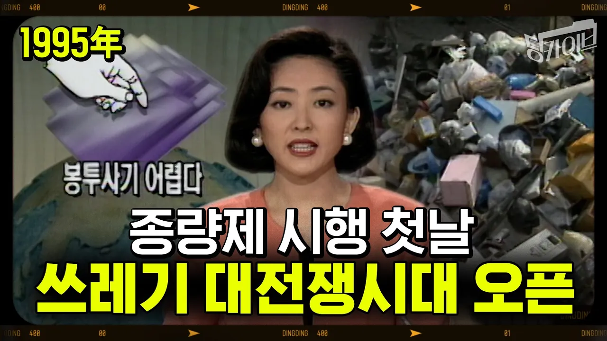

# [딩카이브]100만 원이면 안 버릴 줄 알았죠.. 90년대 종량제 봉투가 생겨난 이유 (feat. 쓰레기 산 골목길)

## 기본 정보
- **URL**: https://www.youtube.com/watch?v=zSZwXidjkLg
- **채널명**: 딩딩대학
- **구독자수**: 4만
- **조회수**: 6,488
- **업로드일**: 2022-11-08
- **영상 길이**: 4:00
- **댓글 수**: 4
- **좋아요 수**: 47

## 썸네일

---

## 댓글 (추천순 TOP 10)

| 순위 | 좋아요 | 댓글 |
|------|--------|------|
| 1 | 4 | 딩카이브...오래전 쓰레기에 관한 컨텐츠를 지금 왜? 단지 종량제 봉투의 가격인상에 대한 정보를 알려주기 위해서 일까요? 두분 총장님에 컨텐츠에는 이유가 있을 것입니다....공부를 하다보면 가끔 보이는 주식종목들... 그러나 내 주식은 라면...ㅡㅡ;;;  ESG 시대를 앞두고 다시 부각되는 폐기물 처리업... 이제는 인수합병을 넘어 독자적인 행보를 보이는 대기업...왜 일까? 동부건설의 동부엠텍....SK건설의 SK에코플랜트...동부를 인수한 엠케이전자... 그들은 왜 폐기물 시장에 달려들었을까? 무엇을 의미할까? 불행하게도 경기 침체기에도 폐기물 업체의 성장률은 멈추지 않았다...리먼때도...코로나 팬데믹 때에도... 그럼 앞으로 경기는? 대기업이 눈에 불을키고 달려드는 폐기물시장을 보니...앞으로 경제는 어둡게 느껴지는군요... 이제는 컨소시엄을 통한 참여가 아닌 본격적인 발톱을 드러내고 경쟁을 벌이는 폐기물산업시장.... 아마도 두분 총장님에 빅피처는 그 시장까지 말해주고 싶은게 아닐지 ...짐작해 봅니다. 영끌...영혼까지 끌어모아 빚내서 투자하는 주식이 아닌...영혼까지 끌어모아 공부하고 생각한 투자가 되었기를... |
| 2 | 1 | 딩카이브 좋아요 👍 👍 👍 👍 👍 |
| 3 | 3 | 모든 역사가 뼈를깎는 변화가 있어야 전성기가 온다라고 하는데 단순 쓰레기 봉투 변화였지만 올바른 개혁이 얼마나 중요한건지 보여주는 영상이네요!! 저때 시행을 안했더라면 정말 쓰레기 더미 속에서 살았을지도 모르겠네요! |
| 4 | 2 | 진짜 서글픈 건 아직도 종량제도, 재활용재 구분도 제대로 알지 못하는 국민들이 많다는 겁니다 ㅠ.ㅠ |
