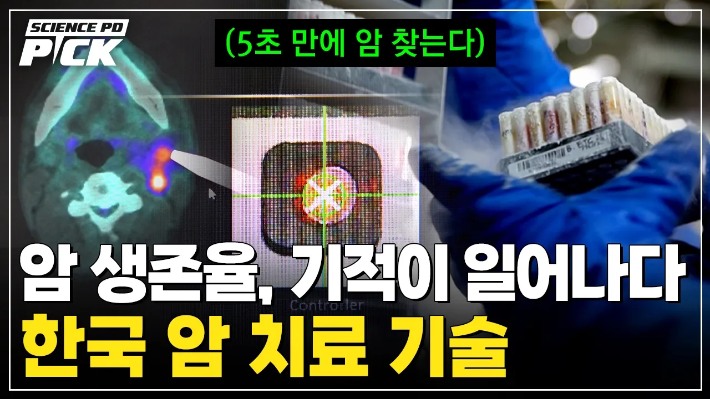

# "암, 더 이상 절망 아니다"..‘암 세포만 제거’ 혁신적 치료 등장! 치료 판도 뒤집은 '한국 암 치료 기술' [Science PD Pick] / YTN 사이언스

## 기본 정보
- **URL**: https://www.youtube.com/watch?v=1WDHpzkbQvk
- **채널명**: YTN 사이언스
- **구독자수**: 86만
- **조회수**: 95,198
- **업로드일**: 2026-06-06
- **영상 길이**: 13:28
- **댓글 수**: 115
- **좋아요 수**: 1,173

## 썸네일

---

## 댓글 (추천순 TOP 10)

| 순위 | 좋아요 | 댓글 |
|------|--------|------|
| 1 | 52 | 국가와 국민들이 바이오에 지원을 많이 해서 암 정복을 하면 좋겠읍니다 |
| 2 | 80 | 암환자 가족있는 분들에겐 이 뉴스가  고통입니다 상용화 되지도 않은것들을  기대감만있고,,,  제발좀 정복좀 해주세요 ㅠㅠ |
| 3 | 21 | 연구다하고.환자에게 쓸수있을때.발표하면 안되나 희망고문 |
| 4 | 12 | 세월이 많이 흘러도 암 사망률은 별 차이가 없습니다 |
| 5 | 43 | 학자 여러분 박수 제발 빠르게 완치되면 좋겠어요 |
| 6 | 21 | 암치료나 탈모치료나 아직 뭐... 늘 당장 치료할것 같아도 시기상조더라구요 |
| 7 | 7 | 안아프게 건강하게 살아야 뭐든할수있고 하고픈 의욕두 생긴다 . |
| 8 | 11 | 현실과 다른 이야기 |
| 9 | 3 | 암 정복도 정복이지만 결국 돈없는 사람은 치료도 못받고 죽어가고 있다는 것 대불제도 산정특례가 있지만 비급여의 비중이 클수록 답이 없고 실손도 비급여 지원이 된다지만 무슨 실손이냐에 따라 천차만별..  그저 한시빨리 개발되여 보험적용이 모두 돼서 돈없어서 치료도 못받고 죽어가는 사람이 없길 바랍니다..물론 개발에 힘쓰시는 모든 박사님들께 감사하는 마음 그분들 또한 마땅한 보답받기를 바라는 마음입니다. |
| 10 | 0 | 암의정복되는그날까지 환우순들께  희망의 넘치는말씀 박사님들께서는  암의대한 연구를많이하셔서 많은생명을 살려주시기를 소명과 사명을다하여주시기를 소망합니다 희망찬 대한민국을 만들어주세요 감사합니다 감사합니다  암환우분들 만세승리   힘내세요응원합니다 화이팅 🎉 🇰🇷 💕 💜 💏 👍 |
