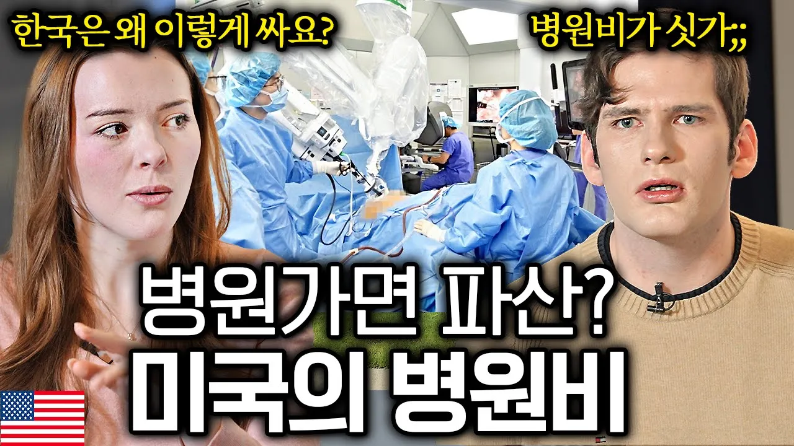

# 한국 병원 처음 간 미국인들이 진료비 영수증 보고 두 눈을 의심한 이유 l 뭔나라 이웃나라 EP.6 l 미국편

## 기본 정보
- **URL**: https://www.youtube.com/watch?v=duAHILZ4OIk
- **채널명**: 세상모든이야기
- **구독자수**: 66만
- **조회수**: 196,484
- **업로드일**: 2025-03-20
- **영상 길이**: 31:38
- **댓글 수**: 267
- **좋아요 수**: 3,531

## 썸네일

---

## 댓글 (추천순 TOP 10)

| 순위 | 좋아요 | 댓글 |
|------|--------|------|
| 1 | 109 | 칼은 이미 연예인이라 많이 봤는데 건실한 청년느낌이라 좋고, 애슐리는 처음보는데 아나운서처럼 말도 잘하고 엄청 스마트한 느낌이네요. |
| 2 | 12 | 감사합니다!! |
| 3 | 50 | 두 분 예슐리 참 솔직하고 마음도 얼굴도 예쁘시네요. |
| 4 | 71 | 애슐리 목소리 좋음 |
| 5 | 22 | 쓰레기문제는 땅덩이문제라 보는데..한국은 땅이 좁으니 더이상 쓰레기 묻을 곳이 없어요. |
| 6 | 62 | 예쁘고 잘생긴 두분 한국에서 좋은일만 가득 가득 하세요 영상잘봤습니다 |
| 7 | 47 | 여자분..말씀 참 재밌게 잘하시네요..^^ |
| 8 | 14 | 김밥이 왜 인기 있었는지 알겠네요 미국인들 입장에서는 획기적이었겠네 |
| 9 | 34 | 완전  한국인 발음..좋아요. 전생에 한국인이였나.. |
| 10 | 22 | 미국에 대한 다양한 문화를 만나 좋았어요. 애슐리 목소리도 좋고 예쁘네요. 한국에서 좋은 추억 많이 만들기 바랄게요! |
