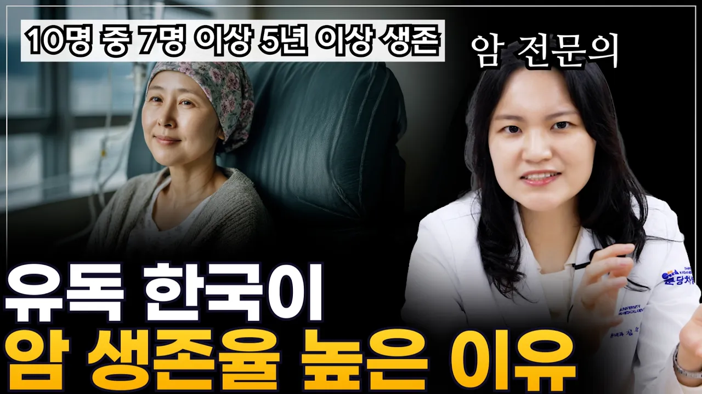

# 217. 미국, 일본 의사들도 놀란 한국 암 생존율 1위의 비결｜단돈 0원의 기적

## 기본 정보
- **URL**: https://www.youtube.com/watch?v=KLnp4Z20zgQ
- **채널명**: 암정복TV
- **구독자수**: 8만
- **조회수**: 4,819
- **업로드일**: 2026-02-18
- **영상 길이**: 9:39
- **댓글 수**: 3
- **좋아요 수**: 172

## 썸네일

---

## 댓글 (추천순 TOP 10)

| 순위 | 좋아요 | 댓글 |
|------|--------|------|
| 1 | 3 | 외국과 다르게 우리나라는 조기검진을 지원해주는 제도가 정말 좋은 것 같아요. 많은 병들이 초기에 치료하면 더 쉽게 치료가 가능한 반면 병이 악화되서 치료하면 예후가 더 안좋으니까요. 통보서 날라올때마다 잘 챙겨서 받고, 주변 가족들도 챙겨줘야겠습니다 |
| 2 | 7 | 조기검진의 중요성을 다시 한번 느끼게 되는 영상이네요. 국가암검진도 꾸준히 받아야겠어요. 좋은 정보 감사합니다. 새해 복 많이 받으세요^^ |
| 3 | 2 | 감사 합니다 잘 보고 갑니다 |
