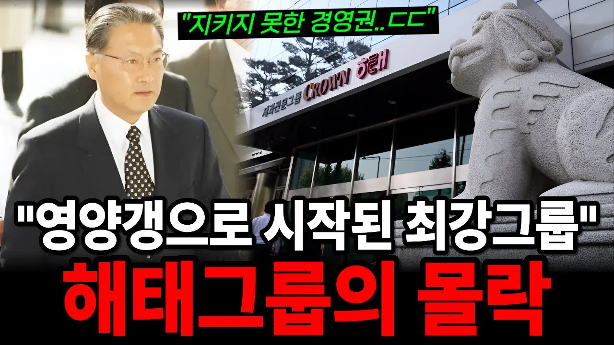

# 과자 팔아 3조 빚더미…29살 2세가 망친 해태그룹의 최후!

## 기본 정보
- **URL**: https://www.youtube.com/watch?v=WrMGwg0ncs4
- **채널명**: 누네띠네 경제학
- **구독자수**: 3만
- **조회수**: 676,692
- **업로드일**: 2026-01-06
- **영상 길이**: 32:18
- **댓글 수**: 1,500
- **좋아요 수**: 12,041

## 썸네일

---

## 댓글 (추천순 TOP 10)

| 순위 | 좋아요 | 댓글 |
|------|--------|------|
| 1 | 602 | 2세를 빡세게 키우지 않으면 헛바람만 들어서 회사의 힘이 자신의 능력인줄 알고 저런 짓을 벌이는거지. 어디 해태뿐일까... |
| 2 | 0 | 2세가 10세가 됐네 |
| 3 | 13 | 그런데 노조도 자신들 자손은 취업보장 하려고 하는거 아닌가요 |
| 4 | 2 |  @u2m7s  현대차노조가 세습취업하려다 욕쳐먹고 그만둔걸 우리나라 선관위가 그짓거리를함 선관위직원 3천명인데 세습취업이 8백몀ㅇ임..정부가 독립기관이라 통제 못하는 틈에 저짓거리함 |
| 5 | 6 | 정용진.. |
| 6 | 110 | 진로 .해태 모두  그놈에 욕심때문!! |
| 7 | 534 | 멍청한 오너가 알짜기업을 말아먹은 대표적인 사례다. |
| 8 | 3 | 지금 이마트 신세계 말아먹은 멸콩 정용진 생각나네 |
| 9 | 8 | 해태타이거스🔥 ㅡ 기아 ㅡ 광주 ⁉️ |
| 10 | 11 | ​ @bonkim2정현 껌도 해태껌 아니면 안 씹는다는 그 놈들? |
