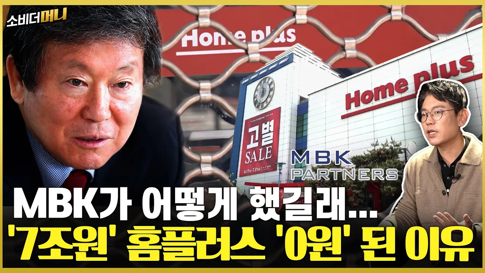

# '고별 세일' '폐점' 잘나가던 홈플러스는 왜 몰락했나 / 소비더머니

## 기본 정보
- **URL**: https://www.youtube.com/watch?v=3O8w6K_O5eM
- **채널명**: 소비더머니
- **구독자수**: 93만
- **조회수**: 604,237
- **업로드일**: 2026-01-04
- **영상 길이**: 18:07
- **댓글 수**: 1,200
- **좋아요 수**: 4,712

## 썸네일

---

## 댓글 (추천순 TOP 10)

| 순위 | 좋아요 | 댓글 |
|------|--------|------|
| 1 | 285 | 마트가 규모의 경제가 엄청 중요함.. 구매할 때 단가도 후려칠 수 있고, 같은 홍보비를 써도 효과가 다르니.. 근데 땅값비싼 알짜점포 다 팔아치운 순간 홈플러스한테 사형선고 때린거엿음... |
| 2 | 14 | 알짜베기 팔아먹고 세입자로 들어간것부터가 팔아먹을려고 들어간거... |
| 3 | 3 | 노조는 얘기안함? |
| 4 | 0 | ​ @모두우회전 노조가 건뭂판건아니죠 |
| 5 | 721 | 무자본M&A는 금지해야돼 |
| 6 | 0 | 하림도 마찬가지 |
| 7 | 21 | 무자본은 아님 MBK 펀드에서 3조2천억원 투자하고 신규 차입 2조7천억원. |
| 8 | 41 | 꼴값을 떠네 MBK가 말아먹은걸 노조탓하냐 |
| 9 | 0 | ​ @key-eyez 노조세요? |
| 10 | 31 |  @key-eyez  mbk와 노조의 합작으로 말아먹은 걸 노조를 쏙 빼는 게 웃기네 정치 구호 뱃지 달고 매장에서 일하니까 사람들이 거부감이 들어서 항의하고 보이콧했었던 것은 잊어버린 거야 그리고 사주가 회사를 살리자고 서로 고통분담하자고 했었을 때 모두 거부했었던 게 노조야 |
