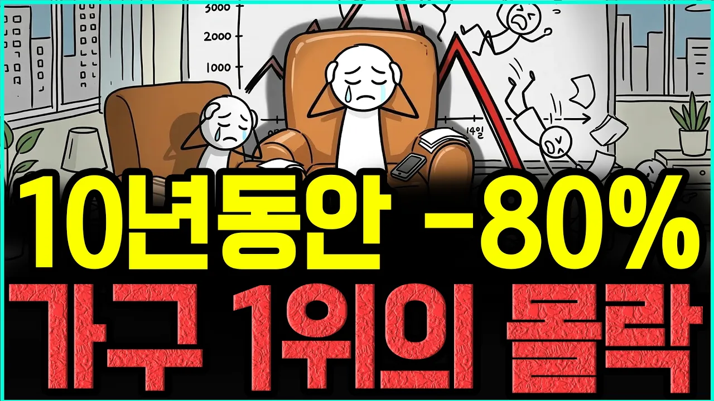

# 한때 24만원… 한샘 주가가 10년 동안 무너진 이유 I 장기투자 폭망 시리즈

## 기본 정보
- **URL**: https://www.youtube.com/watch?v=R_IwIiVhPC4
- **채널명**: 너와 나의 경제학교
- **구독자수**: 3만
- **조회수**: 2,735
- **업로드일**: 2026-03-15
- **영상 길이**: 3:30
- **댓글 수**: 3
- **좋아요 수**: 20

## 썸네일

---

## 댓글 (추천순 TOP 10)

| 순위 | 좋아요 | 댓글 |
|------|--------|------|
| 1 | 1 | 사모펀드가 산 거 자체가 이미 회사는 망한 것 |
| 2 | 0 | 오늘 35,200원이네요 사모펀드 대주주의 반대매매 방지를 위해 주가 부양 할 것으로 봅니다. |
