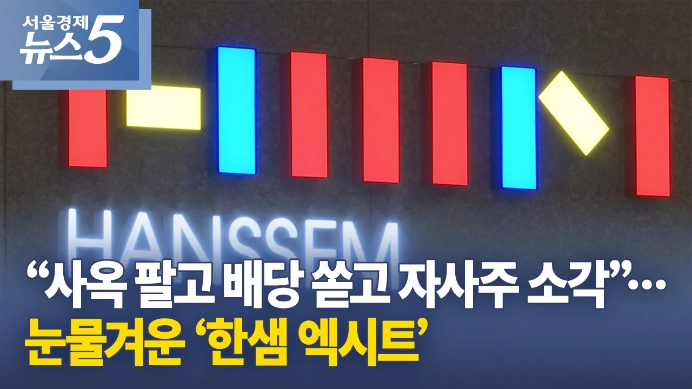

# “사옥 팔고 배당 쏟고 자사주 소각”…눈물겨운 ‘한샘 엑시트’

## 기본 정보
- **URL**: https://www.youtube.com/watch?v=yQJ_F17F_kQ
- **채널명**: 서울경제TV
- **구독자수**: 53만
- **조회수**: 280,532
- **업로드일**: 2026-02-09
- **영상 길이**: 2:46
- **댓글 수**: 458
- **좋아요 수**: 853

## 썸네일

---

## 댓글 (추천순 TOP 10)

| 순위 | 좋아요 | 댓글 |
|------|--------|------|
| 1 | 751 | 홈플 꼴 나는거지 뭐. 알짜 자산 다 팔아먹고 회사 껍데기만 남기는... |
| 2 | 1 | ㅋ |
| 3 | 1 | 이 쓰레기같은회사 아직도 안망했나.. |
| 4 | 1 | 그러니까 한샘같은 뭐도 없는 기업에 왜 투자함ㅋㅋ |
| 5 | 5 | 또모펀드야?? |
| 6 | 14 | 사모펀드가 하는게 그거죠 뭐 ㅎㅎ 가서 자산 다 팔아서 수익내고 기업은 버리고 도망ㅎㅎ |
| 7 | 2 |  @freshminari7117  애초에 사모펀드에 팔렸다는거 자체가 기업이 병신같이 굴러갔으니까 팔린거아님? 걍 꼴좋은거임 ㅋㅋ |
| 8 | 14 |  @freshminari7117  무조건 다 뜯어 파는건 아니에요. 수리고물상에 가깝죠.  이왕이면 고쳐 팔려고 합니다. 그런데 고장이 너무 심해서 수리가 안되네요? |
| 9 | 3 | ​ @riaac2143  고장이 너무 심한거면 애시당초 사려고 했겠나 ㅋ 핵심 자산을 다팔아치우고 나니 껍데기만 남은걸 누가 사주길 바라는 사기꾼에 불과 ㅋ |
| 10 | 0 | ​ @Hyuchan1002  고쳐팔려고 산거죠. |
