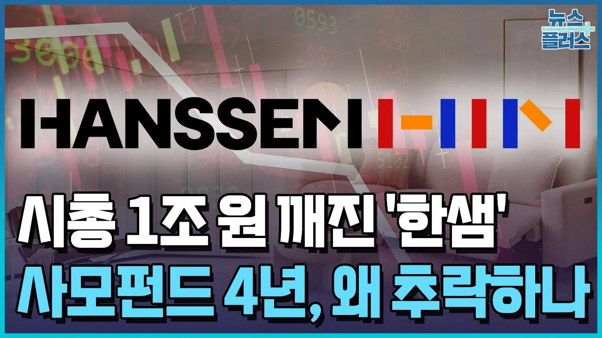

# 시총 1/3 토막...사모펀드 4년, 추락하는 한샘 왜? / 한국경제TV뉴스

## 기본 정보
- **URL**: https://www.youtube.com/watch?v=d4gLnVMgBoM
- **채널명**: Korea Business News
- **구독자수**: 23만
- **조회수**: 68,255
- **업로드일**: 2025-04-09
- **영상 길이**: 4:07
- **댓글 수**: 125
- **좋아요 수**: 413

## 썸네일

---

## 댓글 (추천순 TOP 10)

| 순위 | 좋아요 | 댓글 |
|------|--------|------|
| 1 | 64 | 버거킹도 사모펀드 인수되고 맛이 예전같지가 않더라.. |
| 2 | 33 | 리모델링 개판쳐놓고 책임안지는 기업으로 악명이 높지 |
| 3 | 36 | 예전에 미국에서 발행된 책 내용이 생각나는구만....미국작가가 미국에서 그많던 기술력 있는 공장을 가진 기업들이 사라진 원인중 하나로 지적한게 바로 사모펀드...회사가 성장하려면 벌어들인 돈으로 다시 기술과 인력에 재투자해야 하는데...그놈의 사모펀드들은 오로지 논놀이에 환장하여 사모펀드들 끼리 사고팔며 머니게임만 하다보니 결국엔 잘나가던 기업들이 줄줄이 도산했다고 했지......한국에서도 미국에서 사모펀드 때문에 일어났던 현상이 그대로 재현되고 있는듯.... |
| 4 | 34 | 한샘 서비스센터 직원들 불친절하고 전문적이지도 성실하지도 않았다 실망 |
| 5 | 172 | 한샘 자체가 경쟁력이 없습니다 한샘 설치하고 나는 아는 사람 모두에게 한샘 설치 하지 말라고 합니다 한샘이 만드는 제품이 하나도 없음-- 전부 외주에서 받아서 팔고 있으니 동일 가격대비 품질이 떨어지고 서비스 도 개판 |
| 6 | 2 | 중국제 |
| 7 | 2 | 대한민국 국가 자체가 경쟁력이 없음 지금 중도산 하는 기업들 보면 ㅋㅋㅋㅋ 노답 국가 |
| 8 | 41 | 홈플러스도 마찬가지 ...샤모펀드 인수에  제약을  가해야 |
| 9 | 30 | 사모펀드에 넘어간 순간 매출이 우상향 아니면 당연한 수순...하지만 매출이 우상향 한다면 애초에 팔지도 않았겠지. 다팔아 먹을거다 사모펀드는... |
| 10 | 41 | 사모펀드를 몇 번 경험해 본 우리나라인데 아직 모르지 않을텐데 |
