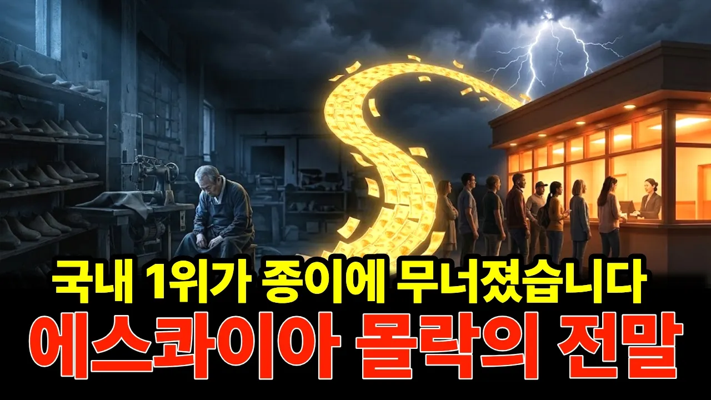

# 국내 1위 구두가 종이 한 장에 무너졌습니다… 에스콰이아 몰락의 전말

## 기본 정보
- **URL**: https://www.youtube.com/watch?v=IP6s9t-eAkw
- **채널명**: 경제스토커
- **구독자수**: 474
- **조회수**: 73,721
- **업로드일**: 2026-09-17
- **영상 길이**: 15:45
- **댓글 수**: 22
- **좋아요 수**: 220

## 썸네일

---

## 댓글 (추천순 TOP 10)

| 순위 | 좋아요 | 댓글 |
|------|--------|------|
| 1 | 20 | 종이는 두번째 보이는 현상이고, 실제 왜 망했는지를 알려줘야지. 초기에 발행해서 그만한 돈을 어디에 투자해서 망했거나,  누가 빼먹었는지, 그런게 망한 원인이지. |
| 2 | 12 | 사직동에 있던 한국사회과학도서관 학교 다닐 때 자료수집하러 많이 갔었죠. 에스콰이어가 만든 도서관이라 좀 의아했었는데. 그 시절이 그립네요. |
| 3 | 10 | 에스콰이어 구두 디자인 이뻤는데 |
| 4 | 4 | 성수동 에슼콰이어빌딩 주인이 이승엽 입니다. |
| 5 | 9 | 할인의 목적은 판촉임. 그러나 할인을 남발하면 회사 입장에서는 매출을 깍아먹는것임. 제살 깍아먹기 라는것임. 할인을 통해 판매량이 늘어도 제품에 생산과 공급에 소요된 비용 이상 이익을 내지 못하면 적자 이고, 기업은 적자를 지속하면 어떤 기업이든 못버팀. 할인을 남발한다? 회사 재정이 어렵거나 곧 무너질수 있다는 징조임. |
| 6 | 14 | 1위에 올랐던 적이 있었나? 늘 1위는 금강 아니었나? |
| 7 | 3 | 금강, Esquire, El Canto |
| 8 | 4 | 요즘은 운동화. 쓰리빠 신구다니는디. 구두는 ㅣ년에 한두번 신음. |
| 9 | 1 | 안타깝습니다 93학번 저는 학창시절 > 젊은날을 함께한 구두로 좋았었어요 대학 합격때, 첫직장 입사때 선물 받은 구두 |
| 10 | 6 | 내 친구 남편과 내가 97년  저 회사에 신입으로 지원했다가 난 낙방하고 친구 남편은 입사했던 기억이 있고....  후에 난 다른 회사에 들어갔는데.. 나중에 보니. 전직원에게 구두 상품권을 엄청 안기고 일부는 상품권을 주변에 팔아오게 하드만.. 나한테도 친구가 이야기 해서 몇번 상품권을 사준 기억이 아직 또렸하게 있다... 영업직도 아니고 디자이너 였는데도... 아무리 회사가 어렵고 힘들어도 그런 말 직원한테 하기 부끄럽다는 생각을 한 사람도 하지 않았단 말인지...   그러다 imf가 닥쳤고... 친구남편 포함 신입직원들 지방출장만 다녀오면 책상이 하나 둘 치워졌지.. 그래도 대학 다닐때 제일 좋아한 구두 브랜드 였는데..  되게 아쉬우면서도 상당히 괘씸한 회사였다.     지금도 브랜드는 살아는 있드만.   구두 디자인이 예전만 못 해서 안타깝고.... |
