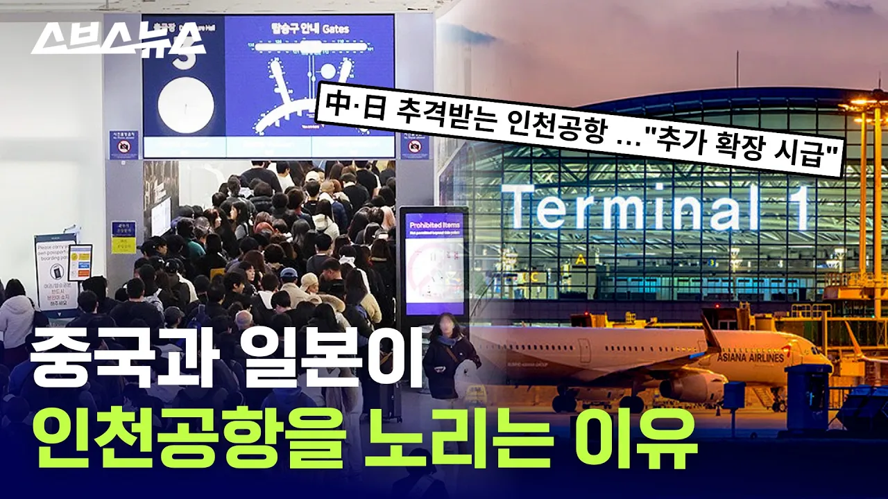

# “이게 한중일 싸움이다” 치열한 1등 공항 쟁탈전 / 스브스뉴스

## 기본 정보
- **URL**: https://www.youtube.com/watch?v=ug5B_gXweac
- **채널명**: 스브스뉴스 SUBUSUNEWS
- **구독자수**: 142만
- **조회수**: 345,485
- **업로드일**: 2026-07-20
- **영상 길이**: 6:23
- **댓글 수**: 849
- **좋아요 수**: 2,569

## 썸네일

---

## 댓글 (추천순 TOP 10)

| 순위 | 좋아요 | 댓글 |
|------|--------|------|
| 1 | 205 | 03:39 동북아 허브 공항 자리 뺏기면 어떻게 돼요? |
| 2 | 27 | 인천은 제3여객터미널 부지와 5번활주로 부지(화물터미널 옆 골프장 부지) 까지 이미 1단계 할때부터 확장성 쩔게 준비해놈. 심지어 여객터미널 자체도 확장가능한 설계임. |
| 3 | 8 | 아쉬운거지. |
| 4 | 1 | 중국이 허브가 되면 중국법에따라 체포될수 있기때문에 가지 말아야함 |
| 5 | 0 | 나리타 하네다 푸동 다싱도 다 허브공항임.. |
| 6 | 13 | 중국은 허브가 될수가 없지 ㅋㅋㅋㅋ |
| 7 | 15 | 7개 게이트는 설계 및 시공 잘못해서 주차장으로만 사용하는데 무슨 확장이야? 있는거나 제대로 사용해라. |
| 8 | 2 | ​@タサイ-i9sㅉㅉ |
| 9 | 0 | ​@タサイ-i9s 쏘리요 미스좌표요 ㅎㅎ |
| 10 | 13 | @タサイ-i9s 또 이상한 거 줏어들어와서 에휴ㅋㅋㅋ 설계상 문제 없고 라인만 다시 그으면 되는거라 이미 라인 다시 그어서 동시 주기 다 가능하고 아무 문제 없다ㅉㅉ |
