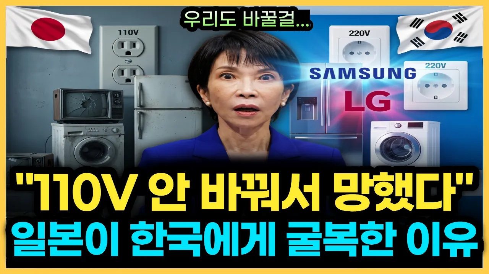

# 110V에 갇힌 일본 전자왕국의 몰락, 신의 한 수가 된 한국의 220V 대전환, 오직 한국만 해낸 진짜 이유

## 기본 정보
- **URL**: https://www.youtube.com/watch?v=YoBNlndpg08
- **채널명**: 이대표 경제학
- **구독자수**: 2만
- **조회수**: 465,985
- **업로드일**: 2026-08-24
- **영상 길이**: 18:22
- **댓글 수**: 218
- **좋아요 수**: 1,638

## 썸네일

---

## 댓글 (추천순 TOP 10)

| 순위 | 좋아요 | 댓글 |
|------|--------|------|
| 1 | 1 | 🔥 [2편 공개] 많은 분들이 기다려주신 후속편이 지금 업로드되었습니다! 해당 영상에 이어지는 핵심 결론과 심층 분석은 아래 영상에서 바로 확인하실 수 있습니다. ▶ 2편 보러가기: https://youtu.be/hkgzuQMdURk?si=U4SbPsiIUj63o8C5 |
| 2 | 73 | 우리나라엔 베토벤 아인슈타인 같은 위인은 아니었지만 나라를 위해 한글을 만드신 세종대왕님부터 전기박사1호 한만춘박사님 개인적으로 한글 키보드 배열을 완성 하신 공병우박사님  그외 등등 우리나라엔 참 훌륭한 분들이 많이 계셨다 |
| 3 | 3 | 베토벤, 아인슈타인이 세종대왕보다 더 위인이다? |
| 4 | 4 | ​ @윤영국-n2g 같은 위인이 아니라 훠얼씬 뛰어난 위인이라고 해석하면서 지나가시죠. 가끔 사대끼가 스치는 사람도 있어요. |
| 5 | 0 | 이승만,박정희 대통도 계시죠~~ |
| 6 | 17 | 역시 대한민국 화이팅 입니다 역시 미래를 바라볼 줄을 아는 대한민국은 다릅니다 |
| 7 | 14 | 국가가 변압기 콘세트를 다 무상 제공했습니다 |
| 8 | 24 | 한만춘, 이런 위인을 왜 기리지 않는지... 이 유튜브를 통해서 처음 들었어요... |
| 9 | 38 | 지도자의 결단이 참 중요하다 |
| 10 | 7 | 그때 바꾸자고 한분 한박사님이 대한민국을 이렇게 만든분이다.  이런분을 더욱더 자세히 그리고 더 많은 국민이 알 수 있도록 조명해주세요! |
