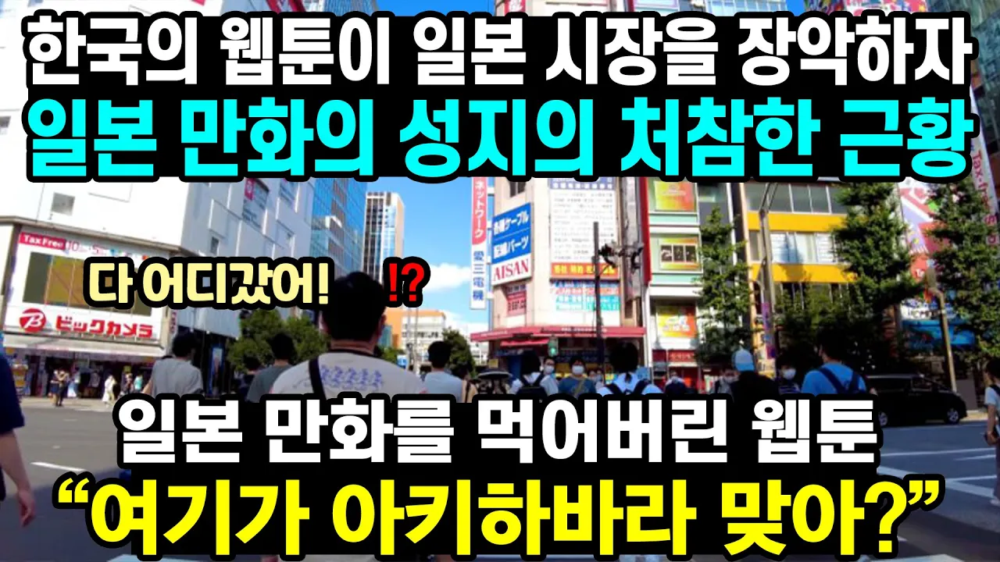

# "점점 사라지는 일본 만화" 한국이 먹었다. 한국의 웹툰이 일본 시장을 장악하자 일본 만화의 성지의 처참한 근황

## 기본 정보
- **URL**: https://www.youtube.com/watch?v=aXWP89aVT6c
- **채널명**: 로버튜브
- **구독자수**: 9만
- **조회수**: 99,902
- **업로드일**: 2022-01-15
- **영상 길이**: 8:41
- **댓글 수**: 355
- **좋아요 수**: 2,995

## 썸네일

---

## 댓글 (추천순 TOP 10)

| 순위 | 좋아요 | 댓글 |
|------|--------|------|
| 1 | 39 | 웹툰이 엄청나게 발전했긴 하지만 이제 겨우 자리를 잡은 것에 불과하며 절대 오만방자에 빠지지 않기를 바랍니다. 무엇보다 현 웹툰 시스템에 문제점을 해결하는게 관건이죠  한국 만화 시장이 세계 6위 정도 되는데 저 미국과 일본 두 거대한 기둥들과 대등해지려한다면  아직도 갈길은 한참... |
| 2 | 1 | 웹툰과 만화랑 다르게 봐야 할것같아요. 만화는 어후...절대적으로 넘버원이죠 . 일본은 만화가 책만 아니라 생활에 다 들어가 있어요... 애니 캐릭터 3D 콘서트가 일상인것 보면 도...도..저. 히..  그 문화를 우린 절대 따라 갈수 없습니다...ㅋ |
| 3 | 1 | 우리나라 애니메이션 사업이 많이 부족하다고 느끼는 사람들 많던데 그 유명한 겨울왕국 엘사 캐릭터 디자이너가 우리나라 사람 김상진 디자이너고 유명한 디즈니에도 한국인 스텝이 많음 우리나라는 기술력은 좋아서 애니메이션 하청 많이 받는데 한국이 미국,일본 애니메이션 하청으로 오래 해온건 검색해서 찾아본 사람들은 다 알고 있는 사실 단지 우리나라는 대표적인 제작사가 없고 국내시장이 작고 안되는 조건이 워낙 많으니 해외로 많이 갈수밖에 없는 안타까운 사정임 |
| 4 | 1 | 한국은 드라마, 웹툰, k pop 강대국임 |
| 5 | 9 | 팩트 말해줄게 잘 봐봐 형들. 
 일본 출판만화가 하락세인 것도 맞고 한국 웹툰이 상승세인 것도 맞아. 
 근데 한국 웹툰시장이 일본 만화시장을 점령해서 일본 만화가 처참한 근황이다? 
 결론만 말하자면 일본 만화시장이 처참한 것은 맞지만 과거에 비해서 처참한 것이고 
 원인 또한 한국 웹툰시장 때문이 아니라 그냥 시대가 변하면서 종이 책을 사는 사람들이 적어졌을 뿐이야. 
 조금만 검색해봐도 나오는 "드래곤볼과 슬램덩크를 뛰어넘은 이태원 클라쓰!!" 이런 기사들, 
 그리고 국뽕에 차올라 웹툰 앞에 K 붙이는 거.(아무도 J망가, USA코믹스라고 안 함 ㅋㅋ) 
 실제로 전세계 만화시장 매출 보면(2018년 기준) 일본 : 40억 1800만 달러 / 미국 10억 2700만 달러 / 중국 : 8억 6000만 달러 / 한국 - 1300만 달러
 한, 중, 미 다 합쳐도 일본 매출에 못 미치는 수준이야. 
 그리고 그렇게 대단한 듯이 한국 웹툰 치켜세우는데 2021년에만 6개의 표절작이 나왔어. 
 전부 한국 웹툰이 일본 출판만화 표절했고 김성모 작가의 고교생활기록부 캐릭터들이 슬램덩크 캐릭터들 트레이싱한 것과 
 뱅캣 작가의 뜨거운 양철지붕 위의 고양이가 에반게리온 캐릭터 표절, 스탠 바이 미 장면 표절, 몬스터 상황, 컷구성, 앵글, 대사까지 표절하고 
 네이버의 엽사는 귀멸의 칼날 주인공 표절, 카카페이지의 소녀지몽이 아이실드21 주인공 얼굴 펜선 트레이싱 등등 
 이외에도 쿠로코의 농구, 나의 히어로 아카데미아, 헌터x헌터, 센과 치히로의 행방불명, 데스노트, H2 등등 
 기타 수많은 일본 출판만화가 한국 웹툰 작가들에 의해 표절 당했지.
 최근에만 해도 네이버 관절 작가의 이매망량이 일본 집영사 작가 후지모토 타츠키의 체인쏘우맨을 표절했다는 의혹들이 나오는데 
 실제로 가서 봐봐. 나도 보기 전까진 판단 안 하는 사람인데 직접 보니까 1화를 거의 그대로 가져왔더라 ㅎㅎ
 
 죽은 일본 출판만화시장이라며? 이미 죽었는데 왜 베끼냐 ㅋㅋ 시체를 베껴서 뭐하려고? 
 아니 한국 웹툰이 더 대단하다며? 근데 왜 아직도 초등학생들은 도쿄 리벤저스, 귀멸의 칼날 무한열차, 코난 극장판 얘기만 하지? 
 드래곤볼 안 본 초등학생들도 칠판에다가 강철의 연금술사나 드래곤볼 프리저, 카이지 그리면 알아보는데 
 마음의 소리 캐릭터나 노블레스 캐릭터, 소녀 더 와일즈 캐릭터 그리면 못 알아보더라?
 (현재 난 부산에서 초등학생들 디지털 드로잉 시간 강사로 애들 가르치는 중)
 실제로 구글 캐릭터 검색순위 보면 1위부터 50위까지 한국 캐릭터는 단 하나도 없고 
 미국, 영국, 일본이 거의 대부분 차지하고 있고 이 중에서도 일본이 압도적 1위야. 
 예전의 드래곤볼뿐만 아니라 진격의 거인, 최근 귀멸의 칼날까지 다양하게 시대별로 있어.
 이래도 일본 출판만화가 정말로 죽었다고 생각해? 한국 웹툰이 정말로 뛰어넘었다고 생각해?
 국뽕에 취해 현실을 부정하고 좋은 점만 보면서 좋게만 말하는 거 진짜 미성숙한 자세고 추한 거 알지?
 제발 일본 만화시장이 대단하다는 거 인정하고, 본받을 거 본 받으면서 한국 웹툰 시장도 성장시켜나가자.
 그럴 듯 하게 짜집게 해서 선동하는 거 쪽팔리잖아^^ |
| 6 | 3 |  @야미-f4d  이 분 말 듣고 생각해봤는데 뭔가 웹툰은 보고나서 덕질하게 되진 않는 것 같네..... |
| 7 | 0 |  @야미-f4d   일본에서 소년점프+라는 인터넷 연제체에서 스파이페밀리 히트치고 단행본 냈는데 2100만부 나옴 이제 일본이 웹툰시장 1위임 |
| 8 | 141 | 이 대역전의 출발은 문화산업 개방이었습니다. 모두가 다 한국이 일본의 문화식민지가 될 것이라고 할 때, 자신을 갖자 우리 문화를 수출할 수도 있는 것이다... 고 격려하고 독려하고 지원을 아끼지 않았던 김대중 대통령의 말이 생각납니다. 항상 시대를 앞서간 이들은 해당 시대에는 비난을 받았었습니다. 그런 이들의 노고 덕분에 지금의 웹툰 그리고 한류가 있는 것이 아닐까 합니다. 대한민국의 21세기가 될 것입니다. 드디어 찾아온 최초이자 마지막 이 기회를 살려서 한민족 웅비의 21세기를 만들어 봅시다. 대한민국 만만세 !!!!!!!!!!!!!! |
| 9 | 0 | 김대중정부의 최대업적이죠 |
| 10 | 0 | 왈왈!바우와우!멍멍! |
