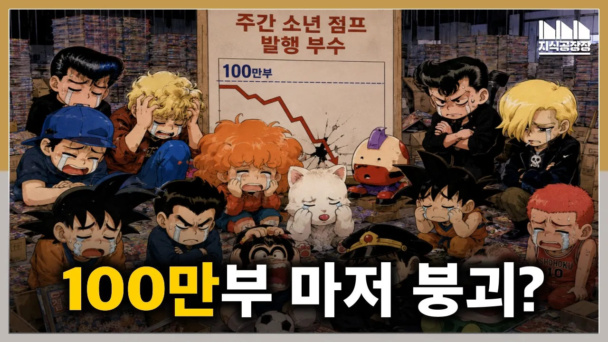

# 경사스러운 100주년에 100만부 붕괴? 소년점프 몰락의 결정적 원인은?

## 기본 정보
- **URL**: https://www.youtube.com/watch?v=bM9iWVIsiMA
- **채널명**: Jisik Manager
- **구독자수**: 13만
- **조회수**: 88,848
- **업로드일**: 2026-08-21
- **영상 길이**: 10:21
- **댓글 수**: 158
- **좋아요 수**: 1,099

## 썸네일

---

## 댓글 (추천순 TOP 10)

| 순위 | 좋아요 | 댓글 |
|------|--------|------|
| 1 | 33 | 100주년에 100만부 붕괴라, 예상은 했습니다만 이렇게 딱 맞아 떨어질 줄은 몰랐습니다...  ◆ 소년점프 관련 영상
 소년 점프의 역사 탄생편 : https://www.youtube.com/watch?v=-x0t4IMdjuA
 소년 점프의 역사 위기편 : https://www.youtube.com/watch?v=vrfYBudstlA
 경사스러운 100주년에 100만부 붕괴? 소년점프 몰락의 원인은? https://www.youtube.com/watch?v=bM9iWVIsiMA
 
 ◆ 전설의 편집자, 토리시마의 희생자(?) 특집
 1편: 편집자가 천재를 만난 날 : https://www.youtube.com/watch?v=T2uKEQHLmBg
 2편: 만화가의 복수 : https://www.youtube.com/watch?v=pPUMOOm7vy8
 3편: 거물 편집자의 실수 : https://www.youtube.com/watch?v=pqGvyk8Q2GY
 
 ◆ 지식공장장
 《돈, 역사의 지배자》 전자책 발매! 많은 성원 부탁드립니다!
 교보문고: https://ebook-product.kyobobook.co.kr/dig/epd/ebook/E000013190636
 알라딘: https://www.aladin.co.kr/shop/wproduct.aspx?start=short&ItemId=398721833
 
 ◆◆ 지식공장장 멤버십 링크
 만들고 싶은 영상을 만들 수 있도록 도와주시겠다면!!
 https://www.youtube.com/@지식공장장/join
 
 ◆ 출간도서
 《돈, 역사의 지배자》 : https://tinyurl.com/2gag649p
 《일본졸업》 : https://tinyurl.com/2lnvovxk
 
 ◆◆ 에듀테인먼트 채널: 지식공장장의 지식공장
 https://www.youtube.com/channel/UCS4Fo217cSqGNTgOhi1IVIA |
| 2 | 52 | 출판 시장 자체가 지금 붕괴긴 함 그만큼 사람들이 지면을 안봄  이제는 잡지든 만화든 컬렉션 용으로만 특정 층한테 비싸게 파는 시대가 당연시 될수도 있을거라고 생각함 |
| 3 | 92 | 이제는 중년점프라서 그런것아닐까요😂 |
| 4 | 6 | 어른점프 ㅋㅋㅋ. |
| 5 | 5 | 중년이 보기에도 재미있어 보이는 게 없음 |
| 6 | 36 | 한국에선 비닐 포장해서  못보게 하는데... 만화 작품들은... |
| 7 | 37 | 대여점이 당장 돈이 된다고 거기에 몰빵하다가 시장 다 작살냈던 우리나라 만화 출판사들이 생각나네. |
| 8 | 60 | 점프만이 아니라 모든 기업에게 통용되는 교훈이군요. 당장의 이익을 위해 미래를 팔지 말라. 명심하겠습니다. |
| 9 | 4 | 그런데 경영진에게 중요한 건 단기 성과라서... 장기 성과를 위해 헌신한 CEO가 신화처럼 여겨지는 이유같습니다. |
| 10 | 75 | 그냥 재미가 없어졌다고 말하면 돌 맞으려나. 근데 사실인 거 같아서 마음이 아파요. |
