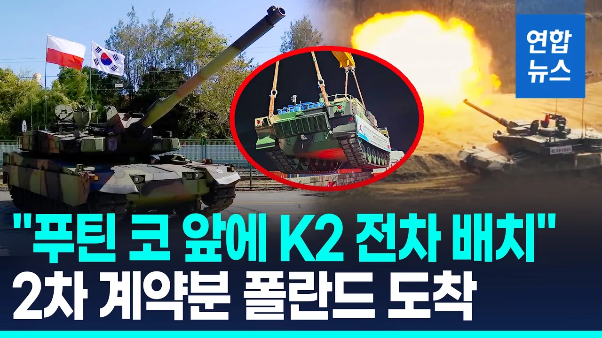

# K2 '흑표' 전차 28대 폴란드 상륙…2차 계약 물량 첫 인도 완료 / 연합뉴스 (Yonhapnews)

## 기본 정보
- **URL**: https://www.youtube.com/watch?v=AM3-vLio1ec
- **채널명**: 연합뉴스 Yonhapnews
- **구독자수**: 113만
- **조회수**: 135,555
- **업로드일**: 2026-08-27
- **영상 길이**: 2:11
- **댓글 수**: 129
- **좋아요 수**: 383

## 썸네일

---

## 댓글 (추천순 TOP 10)

| 순위 | 좋아요 | 댓글 |
|------|--------|------|
| 1 | 34 | 배송에 진심인 나라 ㅋㅋㅋ |
| 2 | 15 | 와 씨부랄 몇년만에 200대라니 대단하다 |
| 3 | 13 | 납기 지키는 방산업체 찾기 힘들다.. |
| 4 | 18 | 자랑스럽다진짜. 에이브럼스.레오파드.k2흑표. 세계3대 전차 ㄷㄷㄷㄷㄷ |
| 5 | 0 | 세계 3차 대전 으로 읽음.. ㅎ |
| 6 | 2 | 무서워 해야하는건 K2흑표전차의 화력이 아니다. 전시체제가 아님에도 불구하고 자국 물량을 제외하고도 수출할수 있는 어마어마하고 압도적인 공업능력, 제조업 능력이야말로 가공할 위력이자 무기다. 전 세계에서 이렇게 찍어낼수 있는 나라는 몇 없다. 영토가 작아도 대한민국이 강대국인 이유다. |
| 7 | 1 | 탱크에 진심인나라 ㄷㄷ |
| 8 | 8 | 에이브람스 레오파트 뒷방 신세 일선은 흑표가 지킴 |
| 9 | 1 | 자꾸 드론드론 하는데 현대전에도 지상전은 전차가 압도적이기때문에 필수임 |
| 10 | 0 | 창원 계신  박사님들감사합니다 |
