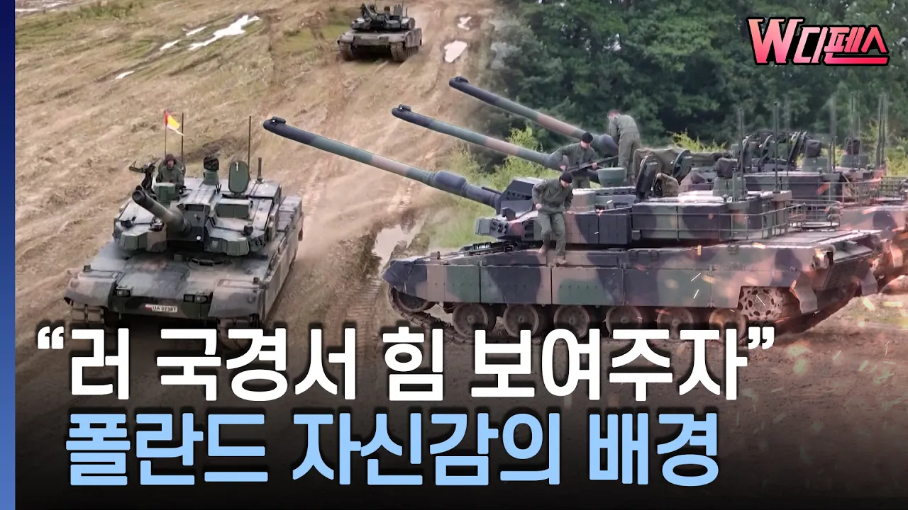

# [W디펜스] "러 국경서 힘 보여주자" 폴란드 자신감의 배경 / 머니투데이방송

## 기본 정보
- **URL**: https://www.youtube.com/watch?v=FuqUr2lnptA
- **채널명**: MTN 머니투데이방송
- **구독자수**: 119만
- **조회수**: 350,583
- **업로드일**: 2026-09-19
- **영상 길이**: 3:38
- **댓글 수**: 131
- **좋아요 수**: 1,231

## 썸네일

---

## 댓글 (추천순 TOP 10)

| 순위 | 좋아요 | 댓글 |
|------|--------|------|
| 1 | 47 | 세계 3차 대전은 필연이라고 노래불러도 안 믿어요 준비 한자만이 살아 남는다 |
| 2 | 2 | 3차대전 가즈아!!😅 |
| 3 | 1 | ​ @조현식-u2v 현식이는 전쟁터지면 당일날 미사일폭격에 오체분시 될듯^^ |
| 4 | 0 | 예언가들이 필히 3차대전 일어 난다고 했으며 1차2차대전도 전부 안일어 난다고 했는데 일어난거임~ |
| 5 | 3 | 그렇다 한들 2차 대전 같은 일은 안 일어 날꺼야,. 직접 당사자가 아닌 방산 기업을 가진 우린 돈 벌 기회다. 그저 네거티브한 사고 가진  당신 같은 애들은 기회를 못 잡아. |
| 6 | 1 |  @yangsu94  전지 전능하신 능력 보여줘 봐 |
| 7 | 2 |  @yangsu94 동아시아 전쟁 나도 그소리 해라 |
| 8 | 2 | K2전차는 3.5세대 최신형은 맞지만 그래도 무적은 아니니까 드론이랑 대전차미사일 안맞도록 조심하면서 방어 하시길 바래요ㅠㅠ |
| 9 | 2 | 조마간 세계 3차 대전 시작하겠군....ㄷㄷㄷ;;;긴장해라 |
| 10 | 9 | 드론은 재래식 무기가 없으니까 너무 올려치기한거고 결국 재래식 무기가 전쟁을 좌우함. |
