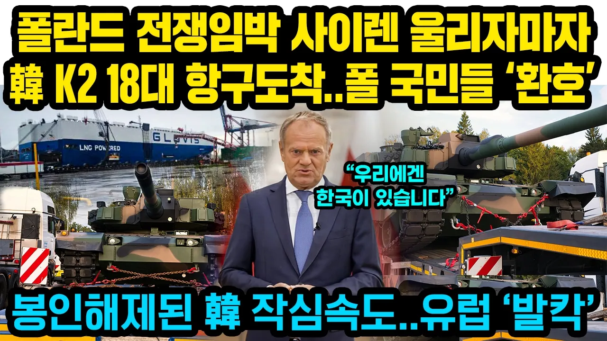

# 폴란드 전쟁임박 사이렌 울리자마자 韓 K2 18대 항구도착..폴란드 국민들 ‘환호성’ 봉인해제된 한국의 작심속도..유럽 ‘발칵’

## 기본 정보
- **URL**: https://www.youtube.com/watch?v=805TaZxe4TY
- **채널명**: 쓸모왕
- **구독자수**: 78만
- **조회수**: 310,983
- **업로드일**: 2026-09-18
- **영상 길이**: 11:15
- **댓글 수**: 198
- **좋아요 수**: 5,134

## 썸네일

---

## 댓글 (추천순 TOP 10)

| 순위 | 좋아요 | 댓글 |
|------|--------|------|
| 1 | 56 | 우리가 전쟁 나길 바라면서 파는게 아니야 전쟁을 막을수 있길 바라면서 만드는거지 |
| 2 | 102 | 한국과 계약한 것은 하늘이 도운 것이다. |
| 3 | 53 | 전 국방부장관 부와슈차크가 진짜 머리 좋은 초 엘리트네. 폴란드 국민들은 그분 진짜 존경해야겠네. |
| 4 | 1 | Ceniony za dynamizm zakupowy, niestyety oskarżany o upolitycznienie armii i chaos proceduralny |
| 5 | 0 | 영웅 |
| 6 | 33 | 부디 폴란드가 저 전차를 쓸일이 없길.... 푸틴 트럼프 시진핑 아소다로 전쟁에 미친 인간들 |
| 7 | 1 | 푸틴 아군임. 우러전쟁 안 벌어졌으면 폴란드 등 유럽에 방산 수출할 수 있었을까? 전쟁이 코 앞이라  미국, 독일 보다 납기가 빠른 우리나라 방산 선택한 거지. 불곰사업(차관상환)으로  들여온 소련제 무기 체계와 기술이 우리나라 무기 개발의 토대 마련에 기여한 것부터 도움만 됐지 피해는 없었음.  오히려 미국이 감놔라 배놔라 진상 짓을 하고 있고~ 그리고 무엇보다 러시아는 장모님의 나라임~~ |
| 8 | 1 | ​ @봉피리-i8u  북한과 상호방위조약한 나라가 어떻게 아군이냐. 북한 인민이냐..? |
| 9 | 17 | 어느 나라든 국익과 국방만큼은 좌,우 가리지말고 한마음, 한목소리를 내야한다!!🎉 |
| 10 | 15 | 자폭 드론은 반드시  탱크를 파괴할수 있도록 진화되고 있고 탱크는  생존을 위해서  드론이 접근하는 것을 미리 탐지하고 떨어뜨려야만 되고,   창과 방패의  끝없는 경쟁은 지금도 계속되고 있네요 |
