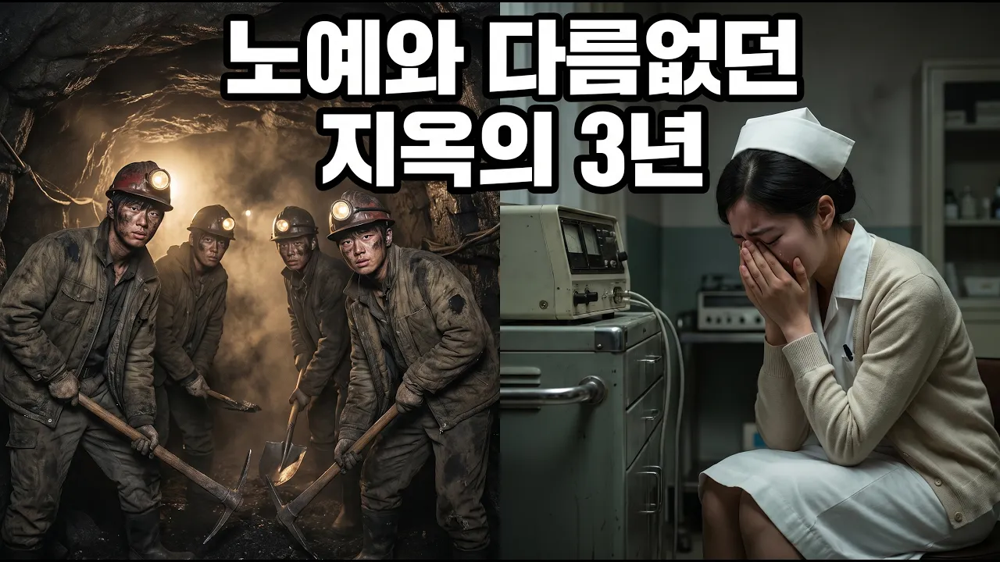

# 파독 광부 간호사, 아프리카보다 가난했던 한국을 구한 경제 기적의 시작 (1960년대)

## 기본 정보
- **URL**: https://www.youtube.com/watch?v=Gf-c06MdFL0
- **채널명**: 시대를기억하다
- **구독자수**: 363
- **조회수**: 410
- **업로드일**: 2026-04-24
- **영상 길이**: 9:20
- **댓글 수**: 4
- **좋아요 수**: 16

## 썸네일

---

## 댓글 (추천순 TOP 10)

| 순위 | 좋아요 | 댓글 |
|------|--------|------|
| 1 | 1 | 잘 보겠습니다😊 |
| 2 | 0 | 따뜻한 인사와 함께 영상을 봐주신다니 정말 감사합니다😊 이번 영상에서는 파독 광부와 간호사분들이 낯선 독일에서 어떤 환경 속에서 일하며 가족과 나라를 위해 얼마나 큰 희생을 감내했는지 담아보았습니다. 단순한 과거 이야기가 아니라, 지금 우리가 누리는 일상의 바탕이 어디에서 시작됐는지를 함께 돌아보자는 마음이었습니다. 시청하시면서 느끼신 점이나 떠오르는 기억이 있다면 편하게 나눠 주세요. 앞으로도 이런 의미 있는 이야기들을 계속 전해드릴 수 있도록 노력하겠습니다. 구독과 알림 설정으로 함께해 주시면 큰 힘이 됩니다. 다시 한 번 감사드립니다! |
| 3 | 1 | 달러는 벌어야 하고 자원 없고 기술 없고 남는건 사람이니 파독 광부, 간호사(?) 월남 파병 까지(수북히 쌓인 탄피 줍고 지급받은 에무십육은 고국으로...) |
| 4 | 0 | 남겨주신 댓글을 읽으니 가슴 한구석이 묵직해집니다. 말씀하신 것처럼 자원도 기술도 없던 시절, 우리가 가진 유일한 자산은 오직 사람뿐이었습니다. 낯선 서독의 지하 막장과 병원선, 그리고 월남의 뜨거운 전장까지, 청춘들이 흘린 땀과 피가 고국의 가족을 살리고 지금의 대한민국을 만드는 위대한 주춧돌이 되었습니다. 그분들의 숭고한 희생과 헌신이 있었기에 오늘날 우리가 이만큼 풍요로운 세상에 살고 있음을 다시 한번 깊이 깨닫게 됩니다.  역사 속 숨은 영웅들을 함께 기억해 주시고 의미 있는 생각을 나누어 주셔서 진심으로 감사드립니다.  소중한 의견을 공유해 주셔서 정말 고맙습니다.😊😅 |
