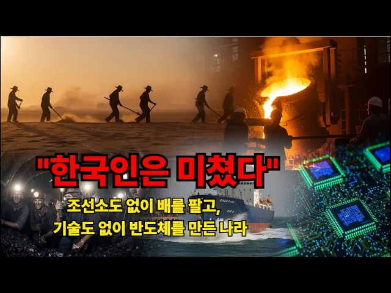

# "한국인은 미쳤다" #한강의기적 #파독광부 #파독간호사 #중동건설 #경부고속도로 #포항제철 #삼성반도체 #현대조선 #리비아대수로 #500원의기적   #산업화 #조선소없이배를팔다

## 기본 정보
- **URL**: https://www.youtube.com/watch?v=n-mcaxrsNnc
- **채널명**: 소리통 타임캡슐
- **구독자수**: 4,580
- **조회수**: 96
- **업로드일**: 2026-02-17
- **영상 길이**: 11:37
- **댓글 수**: 1
- **좋아요 수**: 1

## 썸네일

---

## 댓글 (추천순 TOP 10)

| 순위 | 좋아요 | 댓글 |
|------|--------|------|
| 1 | 0 | 50도 사막에서 삽을 들었던 아버지, 지하 1,000미터에서 곡괭이를 들었던 청년들, 집에 오지 못한 채 달러를 부쳤던 그 사람들. 이 영상은 그분들의 이야기입니다. 혹시 이 시대를 직접 살아오신 분이라면 댓글로 그때 이야기를 들려주세요. 아버지, 어머니의 이야기를 들려주세요. 여러분의 한 줄이 대한민국의 역사가 됩니다. 🙏 구독과 좋아요는 다음 영상을 만드는 큰 힘이 됩니다. |
