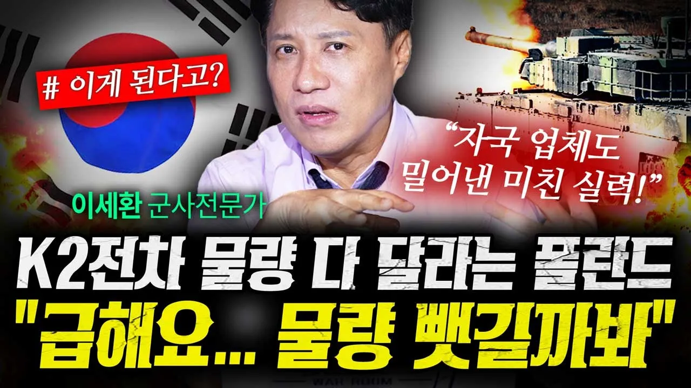

# 자국 업체까지 버리고 폴란드가 K2전차 선택한 이유 (샤를세환) | 작전본부

## 기본 정보
- **URL**: https://www.youtube.com/watch?v=KhezuiJ1LO0
- **채널명**: 연합뉴스경제TV
- **구독자수**: 108만
- **조회수**: 1,639,728
- **업로드일**: 2025-08-02
- **영상 길이**: 15:09
- **댓글 수**: 905
- **좋아요 수**: 18,542

## 썸네일

---

## 댓글 (추천순 TOP 10)

| 순위 | 좋아요 | 댓글 |
|------|--------|------|
| 1 | 159 | 충성! 밀리터리의 모든 것 <작전본부>  이번 시간은 역대 최대 수출액! 폴란드는 왜 자국업체 버리고 K2 전차를 선택했을지 다뤄봤습니다. 이어서 '일본이 우리나라 FA-50 경공격기에 눈독 들이는 이유' 바로보기 ☞ https://youtu.be/lFU8NJEXx7A |
| 2 | 4 | 돈은 제대로 받고 보내는 거임 ?? |
| 3 | 3 | 돈 못준다고 오늘 뉴스 나왓다 |
| 4 | 5 | 이젠 하다하다 영상 검수까지 안하네... 뒤에 블랙이에요 아저씨들... 자막 검수는 그렇다치고 이건 기본이잖아 ㅋㅋㅋㅋㅋㅋㅋㅋㅋㅋㅋㅋㅋㅋㅋㅋㅋㅋㅋㅋㅋㅋㅋㅋㅋㅋㅋㅋㅋㅋㅋㅋ |
| 5 | 4 |  @연합뉴스경제TV  nie ma produkcji czołgów w polsce. Pamiętasz to słynne tłumaczenie burmistrza tłumaczącego się że nie przywitał Napoleona  salwa honorową z armat? Po pierwsze nie mamy armat. |
| 6 | 1 | 폴란드 k2 수입 끊고 유럽 다른 국가 전차로 바꾸는 중인거 같더만 |
| 7 | 322 | Greetings from Poland to Korean bros. Poland and Korea share similar history, so good and solid equipment means a lot to us. Stay strong and we hope to strengthen our relations, so we could make more great deals in future. |
| 8 | 40 | 폴란드도 외세에 엄청나게 시달렸죠. 한국처럼 침략을 너무 많이 받고 주권을 잃기도 했고요. 폴란드 형제들의 승리를 기원합니다. |
| 9 | 16 | 화이팅입니다 🎉 폴란드! |
| 10 | 13 | 형제의 국가입니다 이젠 |
