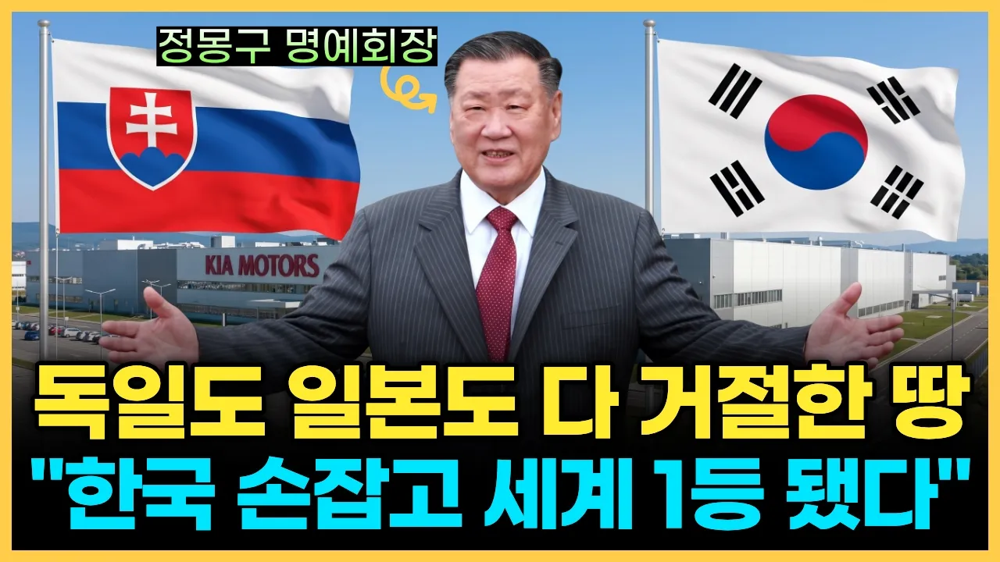

# "독일도 일본도 버린 땅" 한국이 손 내밀자 세계 1위가 된 유럽 최악의 흙수저 국가

## 기본 정보
- **URL**: https://www.youtube.com/watch?v=cFWKcQNOLZQ
- **채널명**: 이대표 경제학
- **구독자수**: 2만
- **조회수**: 453,625
- **업로드일**: 2026-07-30
- **영상 길이**: 27:12
- **댓글 수**: 122
- **좋아요 수**: 5,077

## 썸네일

---

## 댓글 (추천순 TOP 10)

| 순위 | 좋아요 | 댓글 |
|------|--------|------|
| 1 | 88 | 안녕하세요, 이대표 경제학입니다.
 
 오늘 정리해드린 슬로바키아와 기아 질리나 공장 편,
 27분이라는 긴 시간을 끝까지 함께해 주셔서 진심으로 감사합니다.
 
 계산기를 두드리면 답은 분명히 폴란드였는데,
 결국 20년 뒤의 결과를 만든 건 조건이 아니라 사람이었습니다.
 그리고 그렇게 쌓은 20년의 신뢰도, 원전이라는 다른 테이블 앞에서는
 끝까지 문을 열어주지는 못했습니다.
 
 여러분은 이 흐름을 어떻게 보셨나요?
 아무도 쳐다보지 않던 벌판을 골랐던 그 판단이 대단하다고 느끼셨는지,
 아니면 원전 결과를 보며 아쉬움이 더 크게 남으셨는지,
 평소 뉴스에서 스쳐 지나갔던 부분이 이번에 새롭게 정리되셨는지.
 
 정답이 있는 질문은 아닙니다.
 편하게 한 줄만 남겨주시면 다음 영상을 준비하는 데 큰 도움이 됩니다.
 
 감사합니다.
 이대표 경제학 드림. |
| 2 | 6 | 목소리가 여러 채널이 다 똑같아요 |
| 3 | 4 | 😊😊😊😊😊😊😊😊😊😊😊😊😊😊😊😊😊😊😊😊😊😊😊 |
| 4 | 3 | 원전 수주 경쟁에서 밀린게 슬로바키아의 뒷통수라기 보다는 과거 한국의 탈원전 정책으로 인한 불안정성이 고려된게 아닐까.. |
| 5 | 0 | 2 |
| 6 | 63 | 기아다니는 아들이 자랑스럽네요 |
| 7 | 85 | 중국, 베트남처럼 은혜를 원수로 갚는 나라와는 손절해야 함. 슬로바키아처럼 고마워하는 나라와 손잡아서 기쁘네요 ❤ |
| 8 | 4 | 국제시장은 치열함. |
| 9 | 3 | 슬로바키아와의 인연을 좋게 봐주셔서 감사합니다. 다만 이번 이야기를 정리하면서 느낀 건, 나라 사이 관계가 고마움이나 서운함보다는 서로의 이해관계가 맞물리는 지점에서 만들어지더라는 점이었어요. 실제로 슬로바키아도 20년을 함께한 우리 대신 원전은 미국을 택했잖아요. 그래서 감정보다 계산을 읽는 게 중요하다는 생각이 들었습니다. 시청 감사합니다. |
| 10 | 1 | 역시 남방계 보단 북방계가 좀더 순수 하고 기만이 적다! |
