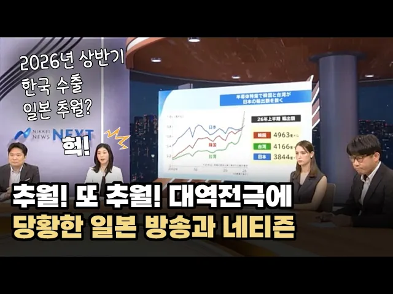

# 한국 수출액 일본 추월하자..일본 방송과 네티즌들의 반응

## 기본 정보
- **URL**: https://www.youtube.com/watch?v=Zj5CkcLJ5Ik
- **채널명**: 호사가타임스 Hosaga Times
- **구독자수**: 4,820
- **조회수**: 184,135
- **업로드일**: 2026-08-11
- **영상 길이**: 9:20
- **댓글 수**: 793
- **좋아요 수**: 2,897

## 썸네일

---

## 댓글 (추천순 TOP 10)

| 순위 | 좋아요 | 댓글 |
|------|--------|------|
| 1 | 64 | 이런 날이 살아 생전에 오는군아...참 대단하다 대한민국 |
| 2 | 2 | 원래 자리로 돌아가는것일뿐 |
| 3 | 77 | 수출량은 한국이 진작에 추월했었음. 일본이 장부상 환율로 눈속임한것뿐이지. |
| 4 | 1 | :virtualhug::yougotthis: |
| 5 | 135 | 강점기 30년간 침범한 나라한테 수출 추월당하니깐 배아프나 |
| 6 | 42 | 국민소득,국가경쟁력,기술수준,나라 빚, 국가혁신지수 등 모든면에서 후진국으로전락중인일봉의현실. |
| 7 | 55 | 일본 매독 사상 최대치로 증가하고 있어 다 하락하는 것만은 아냐 ㅋㅋㅋ |
| 8 | 7 | ㅋ ㅋ ㅋ... 석열이와 일본의힘 입장은?? |
| 9 | 6 |  @박우영-e5h  일본의 힘? 그것만이 아니죠. 일본중국의 힘이 국힘당입니다. |
| 10 | 2 | ㅋㅋㅋㅋㅋㅋㅋㅋㅋㅋㅋㅋㅋㅋㅋㅋㅋㅋㅋㅋㅋㅋㅋㅋ |
