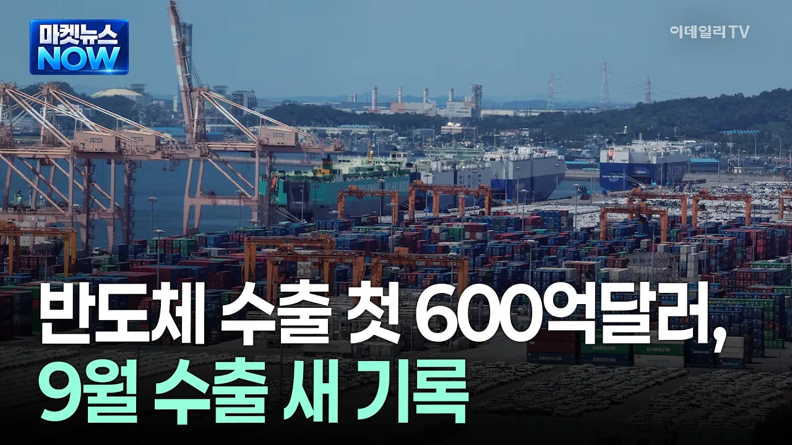

# [마켓뉴스NOW] 반도체 수출 첫 600억달러, 9월 수출 새 기록 | Market Now 2 (20261001)

## 기본 정보
- **URL**: https://www.youtube.com/watch?v=tNrqGq86qo4
- **채널명**: 이데일리TV
- **구독자수**: 40만
- **조회수**: 13,015
- **업로드일**: 2026-10-01
- **영상 길이**: 1:08
- **댓글 수**: 27
- **좋아요 수**: 52

## 썸네일

---

## 댓글 (추천순 TOP 10)

| 순위 | 좋아요 | 댓글 |
|------|--------|------|
| 1 | 9 | 가자 더 앞으로 |
| 2 | 6 | 1조 달러는 기정사실이고 아마 국제정세에 큰 변화 없다면 1조 1천억 달러도 넘어 설듯... |
| 3 | 7 | 그저 갓 재  명 ㄷ |
| 4 | 4 | 이재명 욕해도 이재명이 하긴하네 |
| 5 | 4 | 12월까지 이 추세가 유지되어 연간 수출 1조 달러를 달성할 경우에ㅜㅜ 미국,독일,중국에 이어 세계 4번째로 '수출 1조 달러 클럽'에 진입!!!!!   수출 1조 달러의 역사적 의미:   ​지금까지 단일 국가 기준 연간 수출액 1조 달러를 돌파한 나라는 중국, 미국, 독일 3개국뿐!!  ​한국이 이를 달성할 경우 세계 4번째 기록이자, 1964년 수출 1억 달러를 달성한 지 62년 만의 성과가 됨...🎉 |
| 6 | 0 | 끝이 어딘가  너무 잘나간다  다음달도 기대해보자 ,,, |
| 7 | 1 | 대단합니다.윤석열땐 3년동안 gpu 하나도 구입 안 했는데.. |
| 8 | 0 | G2가 아니라 G3 국가의 리더가 돼자 |
| 9 | 0 | 이재명은 합니다 개가 짖어도 기차는 간다 |
| 10 | 0 | 재명이 호남반도체, 초과수익 재분배 같은 개소리만 했는데 저게 진짜 이재명 업적이라고 생각하시는 분들은 지능에 문제있나? |
