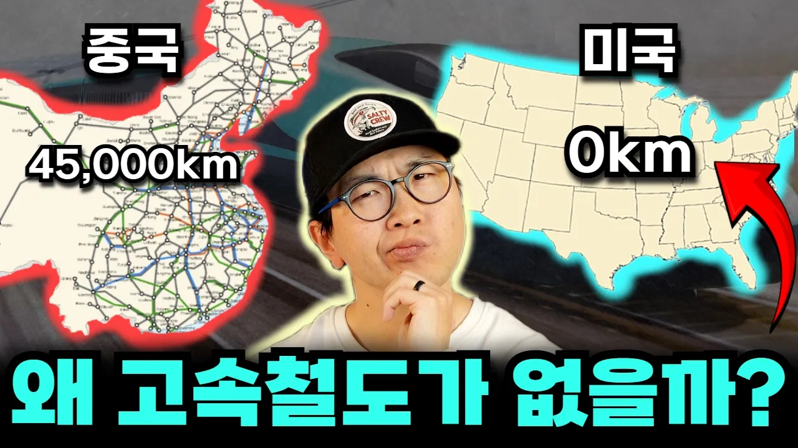

# 캘리포니아가 190조 예산 고속철도 건설을 한국에 맡겨야하는 이유

## 기본 정보
- **URL**: https://www.youtube.com/watch?v=F-kHWnN1rS4
- **채널명**: 세상요정 밋돌세
- **구독자수**: 21만
- **조회수**: 127,391
- **업로드일**: 2026-04-13
- **영상 길이**: 27:11
- **댓글 수**: 410
- **좋아요 수**: 3,306

## 썸네일

---

## 댓글 (추천순 TOP 10)

| 순위 | 좋아요 | 댓글 |
|------|--------|------|
| 1 | 39 | https://surfshark.com/mitdolce 링크에서 혹은 결제시에 쿠폰코드 MITDOLCE 입력하시고 Surfshark VPN 추가 4개월을 무료로 받아보세요. |
| 2 | 1 | 오빠 말 넘흐 재밌게 잘해요👍 |
| 3 | 208 | 뇌물이 아니라 소송과 드러누움으로 슈킹이라니 미국은 참 상식을 뛰어넘음 |
| 4 | 12 | 우리나라는 달라? |
| 5 | 8 | 그 소송하고 드러눕는게 자동차업계 후원받은 집단이긴 함  가장 대표적인게 1985년 LA 메트로 레드라인 연장 공사 중에 메테인 폭발로 로스 매장 하나가 화재에 휩싸였었는데 Henry A. Waxman라는 사람이 이걸 빌미로 메테인 가스가 있는 곳에 지하철을 뚫지 못하게 한다는 법안을 통과시킴. 덕분에 LA D선은 지금처럼 한인타운 끝자락에서 애매하게 끝나게 되었고 NoHo 연장선은 BRT로 다운그레이드되고 터널이 도로로 우회하여 소요시간이 늘어나는 등 LA 대중교통에 상당한 손실과 지연을 만들어낸 인물임  다행히 이 법안은 2006년에 폐지됐지만 이미 공사비는 10배가 넘게 올라서 지금 LA는 지하철 공사비를 1km 연장하는데 1조 넘게 쏟아붇고 있음 |
| 6 | 77 | 우리나라도 경부고속도로 앞에서 드러누움. 그러거나 말거나 박정희 대통령이 경부고속도로 개통함 ㅋㅋ |
| 7 | 1 | ​ @wieberms 어엌ㅋ |
| 8 | 39 |  @wieberms 드러누웠던게 dj라는게 더 충격이었음 |
| 9 | 14 |  @bebebbbbbbb  김대중 김영삼이 들어누었다는건 일베 거짓말임. 검색 조금만 하면 알건데 이렇게 날조하내 |
| 10 | 4 | ​ @bebebbbbbbb  실제로 드러누운 건 아님 |
