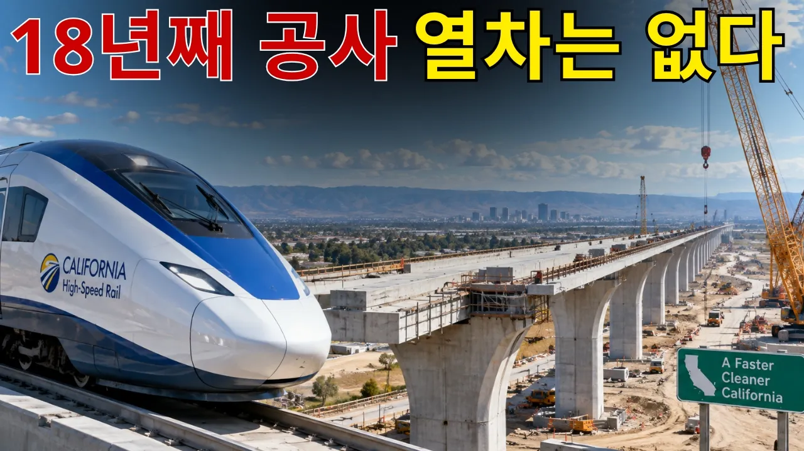

# 330억 달러가 1,261억 달러로… 미국 고속철도는 왜 아직도 달리지 못하나?

## 기본 정보
- **URL**: https://www.youtube.com/watch?v=1yCwZuDwhZ0
- **채널명**: 테크 프론티어
- **구독자수**: 5
- **조회수**: 701
- **업로드일**: 2026-09-10
- **영상 길이**: 32:26
- **댓글 수**: 1
- **좋아요 수**: 1

## 썸네일

---

## 댓글 (추천순 TOP 10)

| 순위 | 좋아요 | 댓글 |
|------|--------|------|
| 1 | 0 | 민주주의의 단점을 여실이 들어나는 미국의 고속철도 ... 현대 민주주의는 그 나라의 시민의식이 일정수준은 되어야 유지 가능함 |
