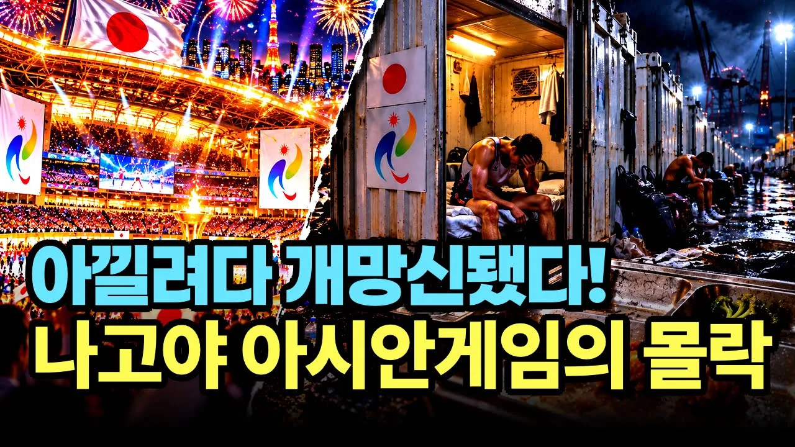

# 나고야 아시안게임 대참사 "선수촌 안 짓겠다"더니 결국 벌어진 재앙

## 기본 정보
- **URL**: https://www.youtube.com/watch?v=7ENIROtu_SI
- **채널명**: 경제꽈배기
- **구독자수**: 1,020
- **조회수**: 168,667
- **업로드일**: 2026-09-27
- **영상 길이**: 18:13
- **댓글 수**: 214
- **좋아요 수**: 1,631

## 썸네일

---

## 댓글 (추천순 TOP 10)

| 순위 | 좋아요 | 댓글 |
|------|--------|------|
| 1 | 22 | 다른건 몰라도 먹고 자는거 만큼은 편안하고  풍족하게 했어야 하질않겠나..... |
| 2 | 20 | 국민들의 지적수준을 하향평준화시켜버리면 나타나는... |
| 3 | 25 | 아낀게 아닙니다. 그들 하던대로 로비(매수)에 더 돈쓰고, 중간에서 예산 뒤로 헤쳐먹던 그버릇 그대로인데 심지어 나라까지 가난해진거죠. 자기들도 아시안이면서 아시안을 경멸하고 손님으로 보지 않는 종특도 한몫하구요.  지금껏  일본 국제행사가 언제 진심이었던적 있던가요? |
| 4 | 0 | 진심을 가질 필요가 잇나요 코리안 들도 아시안게임 왜하는지 모르겟다 면서 안보 는데 |
| 5 | 13 | 전형적인 후진국형 경기개최다~ |
| 6 | 9 | 아낀다더니 더 쓰는 아이러니... 이렇게 또 일본 국민의 세금이 😂😂😂 |
| 7 | 57 | 일본은 더 이상 국제대회 유치하지 마라 |
| 8 | 4 | 올림픽이고 아시안게임이고 한국서 유치하려면 나고야처럼 해라.  어차피 인기도 없고 관심도 없는 올림픽에 어시안게임,  나고야를 반면교사로 삼기 바란다 돈이라도 덜 까먹게 |
| 9 | 3 | 국제 대회를 없애라 |
| 10 | 9 | 아시안게임 유치운영이 목적이 아니란거지 |
