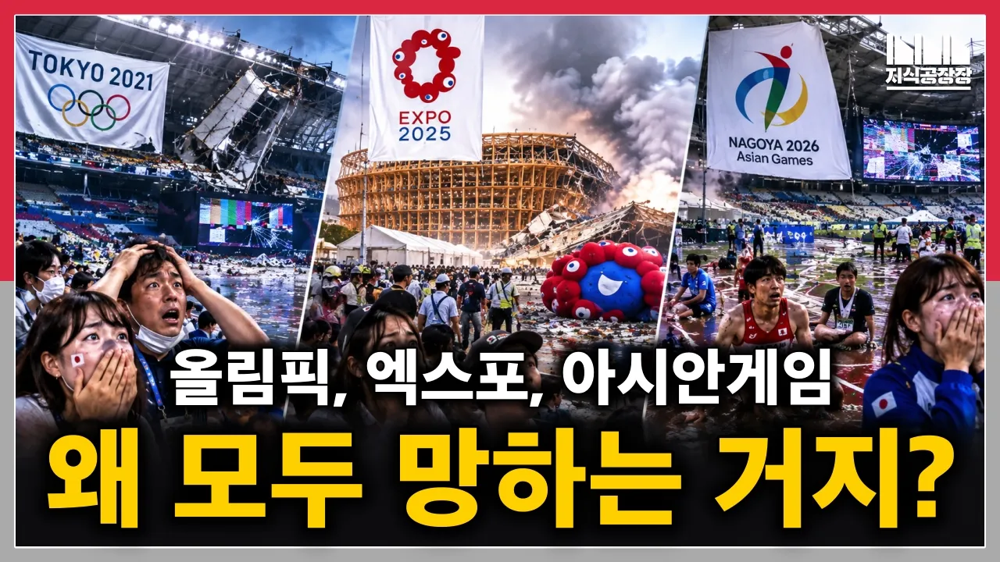

# 도쿄 올림픽, 오사카 엑스포, 나고야 아시안 게임까지, 일본 대형 이벤트가 연쇄 폭망하는 진짜 이유

## 기본 정보
- **URL**: https://www.youtube.com/watch?v=QN4tNWFkgV8
- **채널명**: Jisik Manager's Factory
- **구독자수**: 7만
- **조회수**: 352,554
- **업로드일**: 2026-09-26
- **영상 길이**: 14:11
- **댓글 수**: 633
- **좋아요 수**: 3,116

## 썸네일

---

## 댓글 (추천순 TOP 10)

| 순위 | 좋아요 | 댓글 |
|------|--------|------|
| 1 | 87 | 이번에는 일본기업을 넘어, 일본이라는 국가의 이벤트 경영, 마케팅에 관한 이야기입니다. 한때는 우리가 배워야 할 모범이었는데 말이죠?  ◆ 취미, 문화 채널
 https://www.youtube.com/@%EC%A7%80%EC%8B%9D%EA%B3%B5%EC%9E%A5%EC%9E%A5/featured 
  ◆ 지식공장장의 네이버 프리미엄
 https://contents.premium.naver.com/jisikmanager/jisik
 
  ◆ 지식공장장의 책
 《돈, 역사의 지배자》 전자책 발매! 많은 성원 부탁드립니다!
 교보문고: https://ebook-product.kyobobook.co.kr...
 알라딘: https://www.aladin.co.kr/shop/wproduc...
 
 《일본졸업》 : https://tinyurl.com/2lnvovxk |
| 2 | 269 | 수십년간 작동하던 시스템이 이제 더이상 작동 안하는데도 그냥 관성대로 계속하는 느낌  책임은 내가 안진다  결과평가 보단 메뉴얼대로 했냐 안했냐만 따지니깐 |
| 3 | 10 | 올림픽이나 아시안 게임, 축구/야구 등등 국제 스포츠 대회 유치 및 국제 이벤트/행사 를 유치하려는 정치인들과 공무원들은 낙선시키고 파면/해고 시켜야만 합니다. 국고와 지방 재정에 큰 적자만 내고, 관광 산업에는 별 도움도 안되고, 공연히 시설물 짓는다고 쓰레기 같은 폐허만 양산하는 꼴이 됩니다. |
| 4 | 50 | 메뉴얼 최종 버전이 1970년대라는 게 문제 |
| 5 | 78 | 아무런 활력도 없고 서서히 죽어가는 사회를 보는 느낌이랄까? |
| 6 | 0 | 거시경제는 과거 전성기에 비해 떨어진 건 맞지만, 일본 신생기업 스타트업들 숫자 및 활기 보면 우리나라보다 더 미래가 밝음. 문화 자유도 및 다양성도, 한류 대성공중인 우리보다 아직 더 우위에 있고. (메이저씬은 한국에게 밀리는데, 서브씬은 일본 아직도 작품들 계속 쏟아지고 내수시장 더 확대되면서 활기참) |
| 7 | 67 | 성장동력이 소멸한지 오래... |
| 8 | 117 | 선수, 관중 실어나르는 버스비랑 식비까지 아낄 줄을 상상도 못했다. 그리고 선수들 침대 작다고 컴플레인 나온 건 일본에서 이번이 처음이 아니다. |
| 9 | 3 | 내기억엔 일본만 두번이다. |
| 10 | 17 | 더이상 매뉴얼이 작동하지 않는 나라.. 관광대국으로 도약하고자 하지만, 관광객 급증의 부작용은 혐오하는 나라가 되어버렸음.. |
