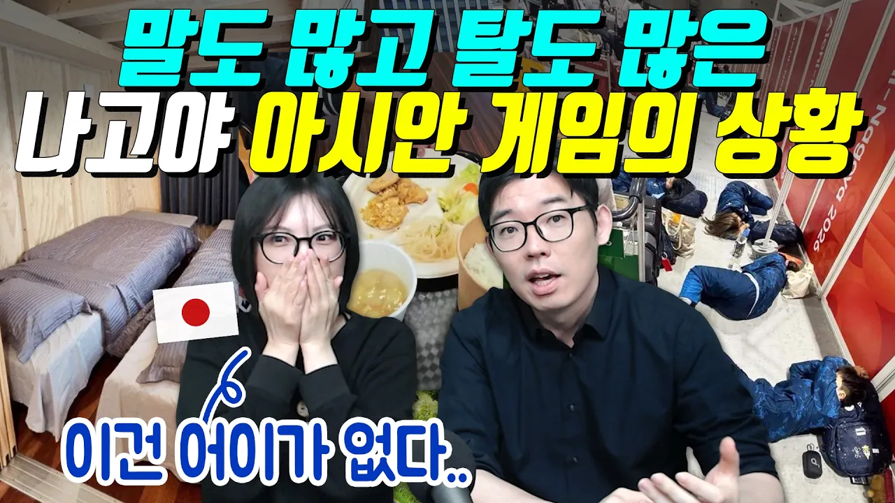

# 말도 많고 탈도 많은 나고야 아시안 게임의 상황

## 기본 정보
- **URL**: https://www.youtube.com/watch?v=D9Qfi4DU_FI
- **채널명**: ぱく家(박가네)
- **구독자수**: 67만
- **조회수**: 1,279,635
- **업로드일**: 2026-09-19
- **영상 길이**: 28:46
- **댓글 수**: 1,800
- **좋아요 수**: 14,153

## 썸네일

---

## 댓글 (추천순 TOP 10)

| 순위 | 좋아요 | 댓글 |
|------|--------|------|
| 1 | 189 | 내 살다 살다 선수들을 길바닥에 재우는 대회는 첨봤습니다. 이게 진짜 국제대회가 맞나 싶습니다 |
| 2 | 1 | 골판지 박스 안에서 자는것보단야 컨테이너에서 자는게 호텔수준일듯 |
| 3 | 2 | ​ @Adam_Lilith 심지어 골판지도 안줌 |
| 4 | 63 | 농구 대표팀 오늘 결승전인데 버스가 오지 않아 훈련 취소~ |
| 5 | 543 | 돈이 없을순 있어... 근데 정신줄은 챙겨야지 ㅋㅋㅋㅋㅋㅋㅋㅋㅋㅋㅋㅋㅋㅋㅋ |
| 6 | 14 | 그러게말입니다 |
| 7 | 3 | 일본에 돈이 없을리가 도둑놈이 중간에 있는거임 ㅋㅋㅋ |
| 8 | 1 | 삼성전자 다닌다고  테헤란로 빌딩주인 조롱하는 정신줄은 ㅋㅋㅋㅋㅋㅋㅋㅋㅋ |
| 9 | 12 | 전과 4범의 대통령인 나라 국민이 할 소리냐?ㅋㅋ 정신차려 |
| 10 | 15 | ​ @초이아브 바둑아!!!간식먹을시간이야😅 |
