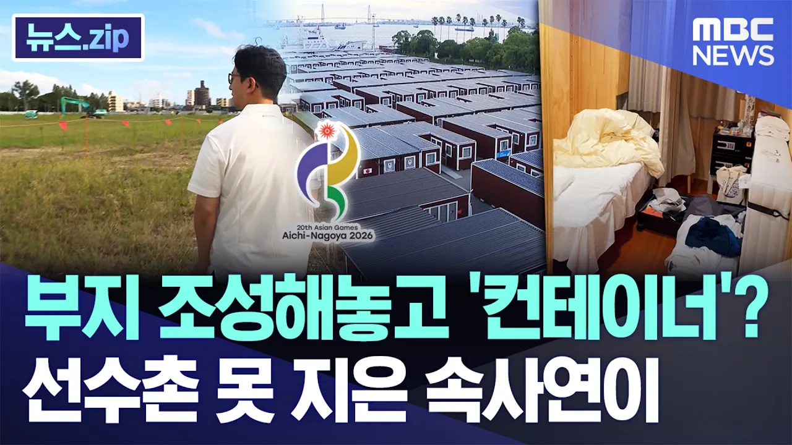

# 부지 조성해놓고 '컨테이너'?..선수촌 못 지은 속사연이 [뉴스.zip/MBC뉴스]

## 기본 정보
- **URL**: https://www.youtube.com/watch?v=YERp_ckavR0
- **채널명**: MBCNEWS
- **구독자수**: 620만
- **조회수**: 13,131
- **업로드일**: 2026-09-15
- **영상 길이**: 5:01
- **댓글 수**: 21
- **좋아요 수**: 77

## 썸네일

---

## 댓글 (추천순 TOP 10)

| 순위 | 좋아요 | 댓글 |
|------|--------|------|
| 1 | 12 | 나라 망하는거 순간이다 |
| 2 | 6 | ..ㅡ ㅡ고문시설이군 ㅋ.. |
| 3 | 4 | 차라리 게르를 짓자..ㅎ |
| 4 | 6 | 높은신분들이 뺴먹을거 따뺴먹고 ㅋㅋㅋ 할려니깐 안되서 ㅋㅋㅈ짓거리한거지 ㅋ |
| 5 | 8 | 일본침몰 |
| 6 | 9 | 이제는 국제대회 개최하면 안되는 시기 적자 적자 적자투성이 ~~~~~ |
| 7 | 1 | 이런 일을 밑을수있는건지...... |
| 8 | 2 | 7~8만원하던 호텔이 40~50만원이 됐으니 쉽지 않아보이네요 |
| 9 | 0 | 처음부터 선수촌 건물 지을 계획도 없었는데 무슨 소리야. |
| 10 | 0 | 역대 최악의 아시안 게임 아닌가? 돈이 없으면 대회를 열지 말았어야지! |
