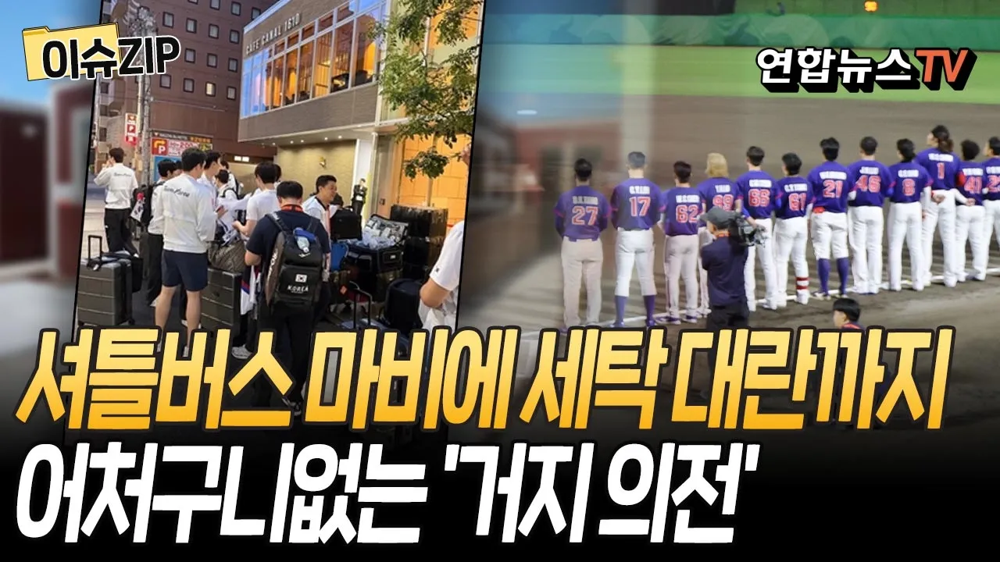

# "이럴 거면 개최 왜 했나"…일본, 'F급 아시안게임' 만들었다｜1980년대 이후 선수촌 없는 첫 대회…수송·세탁 문제는 아직도 진행 중 [이슈ZIP] / 연합뉴스TV

## 기본 정보
- **URL**: https://www.youtube.com/watch?v=g3DIMAAJLZU
- **채널명**: 연합뉴스TV
- **구독자수**: 230만
- **조회수**: 32,182
- **업로드일**: 2026-09-24
- **영상 길이**: 7:18
- **댓글 수**: 36
- **좋아요 수**: 119

## 썸네일

---

## 댓글 (추천순 TOP 10)

| 순위 | 좋아요 | 댓글 |
|------|--------|------|
| 1 | 34 | 일본이 개발도상국 수준으로 돌아갔다는 걸 스스로 증명한 대회.  거기다 선수들 탓, 다른 나라탓으로 돌리는 예의바른 말솜씨까지. |
| 2 | 1 | 개도국도 이렇진 않을ㄷ스요 |
| 3 | 15 | 아시아  어느나라에서 개최해도 저렇게 엉망은 아닐꺼 같은데… 완전 최악임 |
| 4 | 13 | 한국도 직접 빨래방 알아봐서 그렇지 손빨래할뻔 ㅋㅋㅋㅋ 이게 우리가 알던 일본임???? |
| 5 | 26 | 수준낮다 역시 |
| 6 | 17 | 경기하러간게 아니구 여러가지 생활체험 아시안대회인가 보다 |
| 7 | 6 | 모든 국가대표팀들이 항의표시로 폐회식 불참 하길 바란다 |
| 8 | 8 | 이게 바로 오모테나시 대접하는것입니다. |
| 9 | 5 | 유치할땐 기를쓰고 로비하면서 도대체  왜저지경일까  다음  올림픽도 유치한다고 난리던데 양심없다 |
| 10 | 6 | 정말 소름끼치는건 우리나라한정이 아니라는거 즉 악의를 가진 이지매가 아니라 조직위의 무능 그 자체라는거 ㅋㅋㅋㅋㅋㅋ 그러게 전문가 말을 처들으라고 코로나때도 전문가들 말은 귓등으로도 안듣더만 ㅋㅋㅋㅋ |
