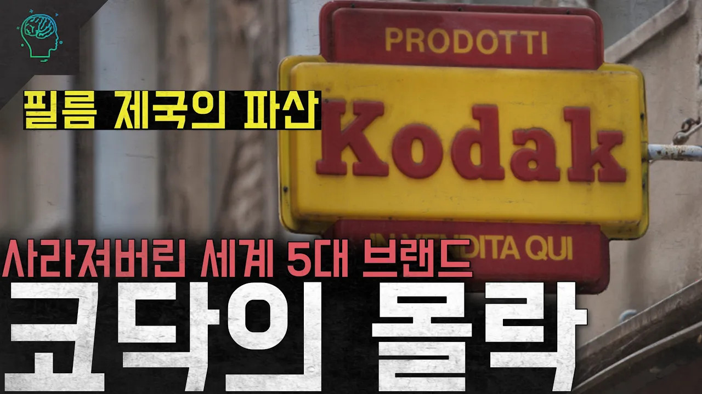

# '파산해버린 필름 제국' 사라져버린 세계 5대 브랜드 '코닥의 몰락'

## 기본 정보
- **URL**: https://www.youtube.com/watch?v=VmndvhhcKTw
- **채널명**: 당신이 몰랐던 이야기
- **구독자수**: 133만
- **조회수**: 197,528
- **업로드일**: 2025-04-28
- **영상 길이**: 13:46
- **댓글 수**: 329
- **좋아요 수**: 3,012

## 썸네일

---

## 댓글 (추천순 TOP 10)

| 순위 | 좋아요 | 댓글 |
|------|--------|------|
| 1 | 31 | 전세계에서 가장 빠른 노드VPN, 
 https://nordvpn.com/dangmolee
 2년 플랜 최대 74% 할인 + 4개월 추가 혜택! |
| 2 | 153 | 폭망한 코닥 vs 바이오, 화장품, 반도체 소재로 떡상한 후지필름. |
| 3 | 46 | 사진 찍는 걸 좋아하던 아버지께서 항상 코닥 필름을 고집하셨죠. 제게는 싸다는 이유로 주식을 매수했다가 0이 될 수도 있다는 교훈으로 남아 버렸네요. |
| 4 | 5 | 5년전에 코닥 주식 며칠만에 800프로 오르고 지금도 주가 높음 |
| 5 | 30 | 호흡기만 달고 있는 기업이 되었구나.. 뭔가 새로운 걸 내놓기에는 이미 수 많은 기업들이 앞서있고 코닥의 움직임을 예의주시 하고 있을 수도 있지 않을까 싶네 변화에 느린 대응을 보이는 코닥이 빠른 대응을 하는 대기업들을 추월 할 수는 없을 것 같다 필름깍는 노인이 된거지 뭐.. |
| 6 | 485 | 코닥 옷입고 해외나가면 코닥 직원이냐고 물어봄 |
| 7 | 146 | ㅋㅋㅋㅋㅋㅋㅋㅋ 네셔널이나 디스커버리는 ㅋㅋㅋ KBS나 MBC 직원 같은 거임ㅋㅋㅋㅋ |
| 8 | 11 |  @띵고스뜨르르륵뽐  다큐멘터리 채널이라 EBS느낌이라던데 ㅋㅋㅋ |
| 9 | 0 |  @띵고스뜨르르륵뽐   EBS 교육방송 이 맞죠 ㅋ |
| 10 | 0 | ​ @띵고스뜨르르륵뽐  그래도 프로스펙스나 필라보단 이쁘긴함 ㅈ도없는게 몽클레어 집착하는게 더 짜침 |
