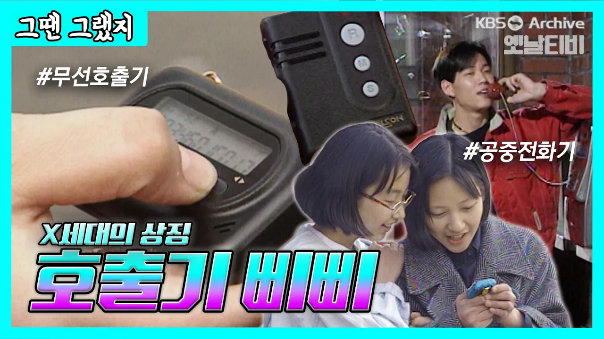

# 삐삐 쳐주세요! 📟 90년대 힙스터들의 필수 아이템 | [그땐그랬지 : 삐삐]

## 기본 정보
- **URL**: https://www.youtube.com/watch?v=pTYmHdl-IdY
- **채널명**: 옛날티비 : KBS Archive
- **구독자수**: 80만
- **조회수**: 62,304
- **업로드일**: 2026-03-27
- **영상 길이**: 11:57
- **댓글 수**: 131
- **좋아요 수**: 422

## 썸네일

---

## 댓글 (추천순 TOP 10)

| 순위 | 좋아요 | 댓글 |
|------|--------|------|
| 1 | 45 | 90년대 좋은시절입니다 |
| 2 | 17 | 아날로그 시대를 추억할 수 있어 좋았던 영상이네요.당시엔 몰랐지만 지나면 모든게 다 그리움.... |
| 3 | 25 | 저 시대가 지금보다 편리함이 떨어지는 시대라지만 낭만과 설레임이 늘 있던 시절이라 너무 그리워지네요 |
| 4 | 15 | 012,015 다 사용해봄~ 삐삐가 불편했지만 목소리른 들을수 있어 좋았다. |
| 5 | 10 | 삐삐 음성 들으려고 공중전화 부스에서 계속 기다리던 생각나네요~ ^^ 추억 돋습니다. |
| 6 | 9 | 90년대 공중전화 삐삐가 있어서 추억에 담았습니다. |
| 7 | 13 | 10년 뒤엔 스마트폰이 그리워지는 시대가 오려나... |
| 8 | 4 | 전화기는 계속 남아있겠죠 |
| 9 | 7 | 저때가 좋았다 |
| 10 | 1 | 96학번.015 나래텔. 삐삐 오면 밤에 공중전화박스 사람들 줄 서 있음. 과 여자애들 혹시 누가 삐삐 쳤을까봐  설레는 그맘. 낭만임 ㅋㅋ |
