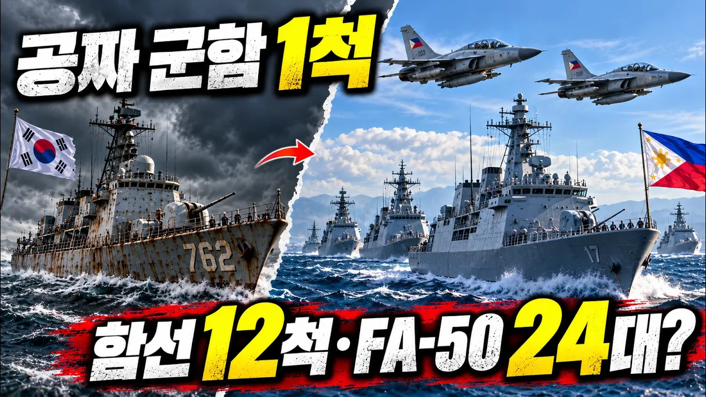

# 공짜 군함 1척에서 함정 12척·FA-50 24대까지… 필리핀이 K-방산을 계속 찾는 이유는?

## 기본 정보
- **URL**: https://www.youtube.com/watch?v=wd_9lC4JXXg
- **채널명**: GUD BH TV
- **구독자수**: 3만
- **조회수**: 17,371
- **업로드일**: 2026-09-25
- **영상 길이**: 8:10
- **댓글 수**: 9
- **좋아요 수**: 87

## 썸네일

---

## 댓글 (추천순 TOP 10)

| 순위 | 좋아요 | 댓글 |
|------|--------|------|
| 1 | 5 | 한국방산과 필리핀 궁합이 절묘하네요 |
| 2 | 6 | FA-50PH 버전 최종 24대로 확정됐다니 대박이네요🎉🎉🎉 |
| 3 | 2 | 보기만해도 흐뭇하네요 대한민국 흥해라!! |
| 4 | 7 | 625참전국중 그래도 필리핀이 개념은 젤로 좋은듯 하네요 |
| 5 | 3 | 한국도 기술력이 여기까지 왔구나~ 🇰🇷 |
| 6 | 6 | 625때 생색만 낸 나라들이 많지만 아시아에서 가장먼저 많이 전투병 파병해서 중공상대로  연천 양구에서 백병전까지 뛴 나라. |
| 7 | 3 | S.korea is like a Sister or Brother to Philippines, me personally i love Koreans, i am willing to fight for S.Korea if War break out between the N.Korea God forbid, love you all Koreans ❤. |
| 8 | 3 | Philippine will buy a KF-21 jet and submarine to and more military equipment 😊 |
| 9 | 1 | 이ai이 초등생 같아 |
