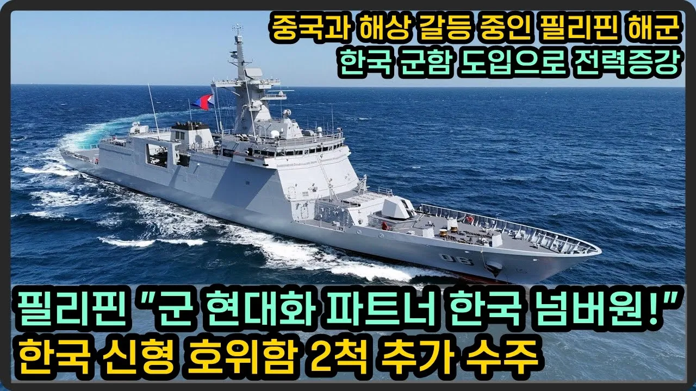

# 필리핀 해군, 한국 신형 호위함 2척 추가 도입, 다른 아세안 시장 진출까지 노린다

## 기본 정보
- **URL**: https://www.youtube.com/watch?v=Jb215GJW7Qk
- **채널명**: 밀리터리 덕후 밀떡
- **구독자수**: 7만
- **조회수**: 24,912
- **업로드일**: 2025-09-28
- **영상 길이**: 8:33
- **댓글 수**: 25
- **좋아요 수**: 1,002

## 썸네일

---

## 댓글 (추천순 TOP 10)

| 순위 | 좋아요 | 댓글 |
|------|--------|------|
| 1 | 10 | Korean people thank you for building high quality ships for us.❤🇵🇭 |
| 2 | 10 | 필리핀  힘내라  파이팅 |
| 3 | 16 | 현대의 필리핀 호위함 추가 수주 축하합니다.  KDDX도 현대가 수주하기 바랍니다. |
| 4 | 11 | 필리핀이 한국 산 호위함 도입하네 |
| 5 | 15 | 현재, 필리핀 수빅만에 현대조선 관련자들이 많이 있습니다....수빅만에 가보면 경치 좋고....그래도 살만한 곳입니다. 본인이 현대조선관련자들이 수빅만에 많이 상주하고 있고 그분들과 대화를 나누어 본 바,,,,앞으로 현대조선소가 확대될 예정입니다. |
| 6 | 0 | Philippines already signed contract before end of the year 2 more frigates with full complement |
| 7 | 2 | 튀리키예 우리는  서로가 서로 함에 무장 ? 짬뽕중이지? |
| 8 | 8 | 내년도 필리핀 국방예산은 추가 첨단무기 구입예산(호라이즌 사업) 포함  약 3200억페소.... 즉, 우리돈 7~8조원.........여기에 육해공군 인건비 1인당 약 100만원,  등 포항하면  예산이 부족함......... 필리핀은 국방과학연구소와 무기생산처를 결합한 무기개발 및 생산국이 별도로 있는데  주로 소총탄약만 생산하므로 98%의 무기는 수입함..... 무기생산은 정밀기계가공기술, 용접기술, 코팅기술, 특히 측정기술이 들어가야 하는데....필리핀은 이런 산업이 없어 무기를 거의 해외에서 구입함 |
| 9 | 8 | 이제 애초에 타국의 조선사들이 제작하는 군함들과 우리나라 조선사들이 제작하는 국산 군함은 벌써 두 클래스 이상 차이날 정도로 한화오션과 HD현대중공업의 조선기술은 압도적입니다. 게다가 LIG넥스원, 한화에어로스페이스 등의 주요 방산기업들의 해상전투시스템이나 각종 미사일들로 넘어가면 이건 뭐 도저히 비교가 불가할 수준이 되었지요. |
| 10 | 1 | 100척추가해도 의미가 있나?추가할수도 없고. |
