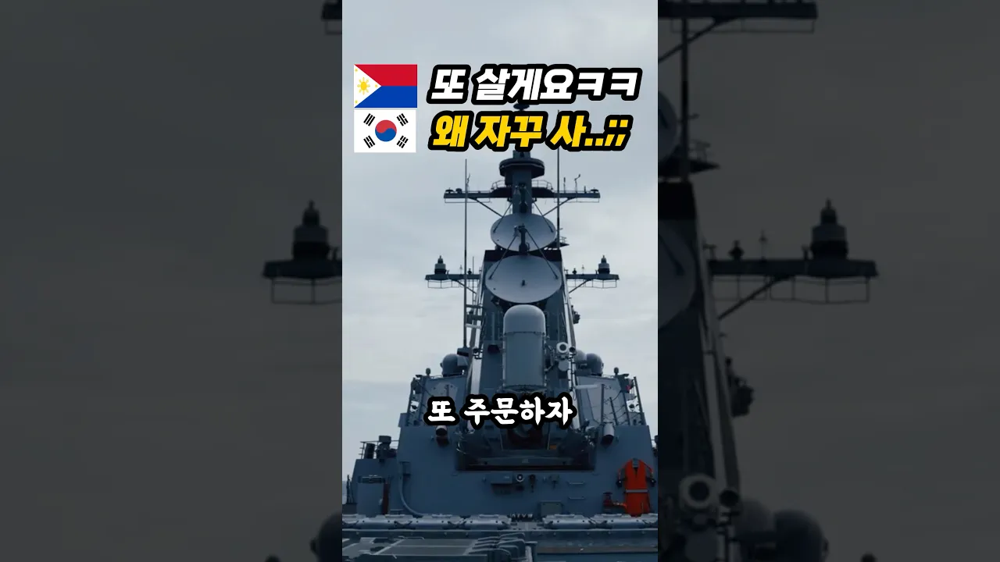

# 필리핀 해군 12척 100% 한국 군함으로 '올인'한 진짜 이유 밝혀지자 中 경악ㄷㄷ

## 기본 정보
- **URL**: https://www.youtube.com/watch?v=hr-IO80Stvg
- **채널명**: 리얼리즘
- **구독자수**: 35만
- **조회수**: 526,166
- **업로드일**: 2025-12-26
- **영상 길이**: 1:06
- **댓글 수**: 217
- **좋아요 수**: 11,067

## 썸네일

---

## 댓글 (추천순 TOP 10)

| 순위 | 좋아요 | 댓글 |
|------|--------|------|
| 1 | 172 | 필리핀 해군 12척 100% 한국 군함으로 '올인'한 진짜~찡이유 ㅎ |
| 2 | 241 | 6.25혈맹   필리핀의    해군력  떡상을   축하합니다  더불어   은혜를   갚게되었으니 기쁨  두배~~ |
| 3 | 25 | *1950년  북한 & 중공 의  625 한국전쟁 남침 당시,                  
 필리핀 은 전투병 파병국가로  
 참전인원  7420명,  전사  192명,  부상  299명,  실종  16명. 포로  41명.
 자유민주주의  대한민국은  필리핀 참전용사 및 
 필리핀  모든 국민에게  진심으로  감사하고  고맙습니다.  
 결코  잊지 않고  기억 하겠습니다.
 *필리핀 625 한국전쟁  참전기념비 : 경기도 고양시 덕양구 관산동 산 97-6. |
| 4 | 16 | 필리핀 한국에 경제원조도 해줬습니다 쌀 받아 먹던 시절이 |
| 5 | 13 | ​ @andrewgang2987   어릴때   시골   탁아소에서 눈에익던   밀가루포대와   쌀포대에  찍혀있던 국기가   필리핀  국기였습니다 |
| 6 | 289 | 죽더라도 적의 머리를 놓고 제사 지낸다!!! |
| 7 | 12 | 멋진데... |
| 8 | 4 | ​ @andpark2782 머리까지는 힘들더라도 팔 다리 1개씩은 떼어놓겠다 아닐까요... |
| 9 | 1 | ​ @알데바란-h9e 글쵸 누가팔다리포기하고덤빌까요? |
| 10 | 0 | ​ @경남멋쟁잉 오징어 다리와 몸통 구워먹을때 맛있는거 알지...ㅋㅋㅋ |
