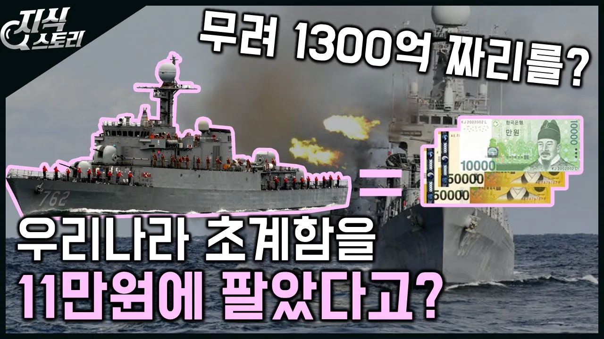

# 단돈 11만원에 필리핀에 우리나라 초계함을 팔았다고? / 1300억원짜리를?? [지식스토리]

## 기본 정보
- **URL**: https://www.youtube.com/watch?v=0x4mf8zvvpg
- **채널명**: 지식스토리 Knowledge Story
- **구독자수**: 68만
- **조회수**: 900,617
- **업로드일**: 2020-03-11
- **영상 길이**: 5:37
- **댓글 수**: 1,200
- **좋아요 수**: 8,480

## 썸네일

---

## 댓글 (추천순 TOP 10)

| 순위 | 좋아요 | 댓글 |
|------|--------|------|
| 1 | 1,600 | 말이 11만원이지 정확히는 필리핀시장을 얻은거죠. 현대중공업과 필리핀사이에서 mou를 체결하고, 추가 수리비와 무기, 부품비용까지 계산한다면 전략적으로 매우 큰 이득을 챙긴거죠. |
| 2 | 40 | @white hole 사실 살을 떼준것도 아니에요 어차피 버릴배였고 해체비용이 오히려 청구될판이였음.  어차피 돈내고 해체할거 필리핀에 증여해서 관계도모하는거죠 |
| 3 | 0 |  @kmjy122  거기에 중국견제, 일본도 같이 필리핀 무장시키는 중임. |
| 4 | 0 | ​ @xingkey  하여간 중국은 만인의 적. 워낙 개념이 없는 국가이니... |
| 5 | 4 |  @필리핀-n1v  필리핀등잣 |
| 6 | 23 | 러시아가 우리한테 써먹은거 그대로 함 |
| 7 | 1 | 이창현 크 똑똑하시네요 세상엔 그냥 주는건 없죠 |
| 8 | 1 | 사실상 저렇게 팔지 않는 이상 고철로 뜯어 팔아야 되는 물건인데 저렇게 하면 미래에 투자가 가능하니까요. |
| 9 | 1 |  @서버팩판매-n9n  ㅋㅋ 매매는 기본적으로 공급과 수요가 맞아떨어져야 이루어지는건 왜 고려하지 않는거죠? 거기다 북한은 UN안보리로 인해 UN가입국은 인도적 지원이 아닌이상 북한과의 거래가 공식적으로 전면 통제되고 있습니다. 필리핀이 이를 무시할 힘이 있나요?  그리고 시장을 얻는다는건 다시말하면, 초계함 포함된 기술력을 바탕으로 대한민국 방위산업의 수준을 따로 증명할 필요가 줄어들게 된다는 것이고 이 시간동안 타 국가는 판매하고자 하는 제품을 어필해야합니다. 그 시간동안 우리는 협상과 조정을 할 수 있게되죠. 더불어 G20국가는 이른바 선진국이라 불리며 G20에서 추구하는 부분 중 하나인 '선진국은 개도국 및 후진국과 상생하며 동반성장 할 수 있게 해야한다'는 부분을 이행한 것이죠.  어떤 논리로 그런 생각을 했는지는 모르겠는데 '인간이 동물과의 차이가 사고의 유무이다' 라는 말이 왜 있는지부터 생각해보세요. 아 그걸 못해서 이런 말을 했나보군요? |
| 10 | 1 | 어제 필리핀해군에서 초계함 2척을 수주했다는 뉴스가떳네요ㄴㅅ |
