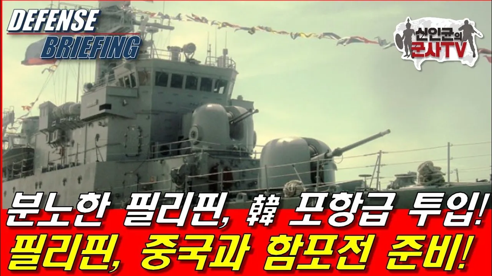

# 韓 포항급에 중국 후덜덜! 분노한 필리핀, 중국과 함포전 준비!

## 기본 정보
- **URL**: https://www.youtube.com/watch?v=lsvddp27w2U
- **채널명**: 신인균의 군사TV
- **구독자수**: 79만
- **조회수**: 483,145
- **업로드일**: 2023-11-02
- **영상 길이**: 20:45
- **댓글 수**: 438
- **좋아요 수**: 27,640

## 썸네일

---

## 댓글 (추천순 TOP 10)

| 순위 | 좋아요 | 댓글 |
|------|--------|------|
| 1 | 54 | 필리핀 용감하다. 전 세계가 밀어줄께 한판 붙어라!! |
| 2 | 39 | 남 걱정할 떄가 아님.  중국이 멋대로 서해 경계선 긋고 압박하고 있음. |
| 3 | 34 | 중국이 필리핀이 국제법을 어겼단다. ㅎㅎㅎㅎ |
| 4 | 53 | 불법 무도한 중국의 행위로 말미암아 주위의 나라들이 어려움을 겪고 있는 가운데 이러한 사태가 발생도 하고 있는중입니다.언젠가 제대로 응징할 때가 오리라는 것을 믿습니다. |
| 5 | 48 | 서해불법중공어선발포해야되요 |
| 6 | 91 | 중국의 억지를 언제까지 봐주야 하나? 필리핀 해군이 강력한 화력으로 필리핀 주권을 수호해주기를 기원합니다. |
| 7 | 49 | 파이팅,필리핀!!! |
| 8 | 152 | 우리나라는 중국 눈치보는 정치, 언론인들 때문에 제대로 대처를 못하고 있는데, 필리핀과 리투아니라 같은 나라를 본받아 국가 안보를 튼튼히 하길 바랍니다. |
| 9 | 6 | 아니죠.정치인들은 중국에 대해 나약한 태도지만 언론이나 국민들을 보면 전세계에 1위 반중국가죠. |
| 10 | 18 | 중국이 국제법을 말하네 |
