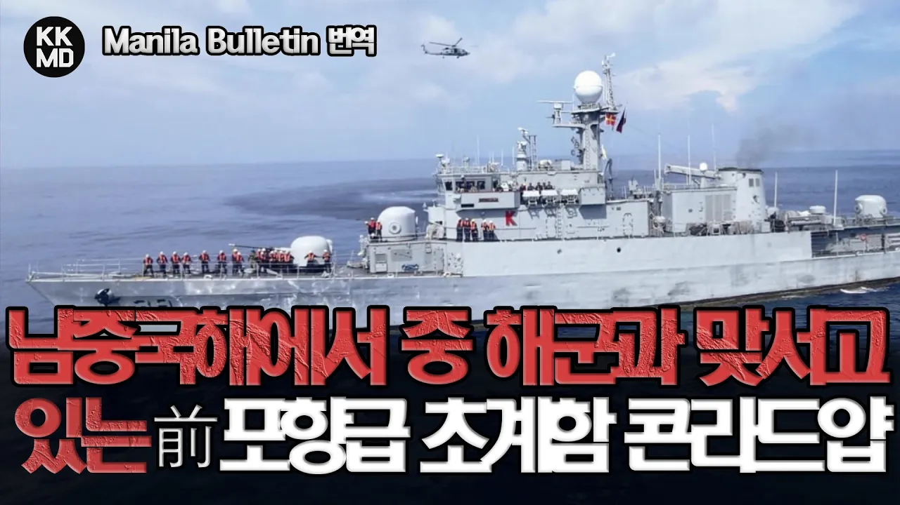

# 남중국해에서 중국 해/공군과 당당하게 맞서고 있는 대한민국 전투함: 필리핀 BRP 콘라드 얍(구 포항급 충주함) (627화)

## 기본 정보
- **URL**: https://www.youtube.com/watch?v=p1HpRj93dbY
- **채널명**: Kevin's Military Channel : KKMD !
- **구독자수**: 22만
- **조회수**: 133,499
- **업로드일**: 2023-11-07
- **영상 길이**: 12:37
- **댓글 수**: 157
- **좋아요 수**: 5,454

## 썸네일

---

## 댓글 (추천순 TOP 10)

| 순위 | 좋아요 | 댓글 |
|------|--------|------|
| 1 | 27 | ※ KKMD는 여러분들께서 챙겨봐 주시는 광고 수익과 Super Thanks 같은 후원으로 운영되고 있습니다. 앞으로도 계속 양질의 컨텐츠를 만들어 갈수 있도록 도움 부탁 드리겠습니다.
 ※ KKMD에서 방송되었던 내용은 kkmd.tistory.com (KKMD 공식 블로그)에서도 만나보실 수 있습니다. 구글(Google) 혹은 네이버 검색 창에서 KKMD를 검색해 보시기 바랍니다. 
 ※ 해외 기사 원문 링크 주소  https://mb.com.ph/2023/10/31/ph-navy-frigate-patrols-bajo-de-masinloc-china-sends-naval-air-forces |
| 2 | 53 | 케빈님의 마지막 멘트가 특히 중요한 내용인듯 합니다. 필리핀해군의 엘리트만 탑승할수 있는 것이라면 이는 곧 그들이 중요한 직책을 가지게 될것이고 곧바로 한국산 무기에 대한 호감으로 이어질 테니까요.  항상 정확한 소식을 전해주셔서 감사합니다😊 |
| 3 | 17 | 울 케빈님 오늘도 유익한 밀리터리 소식 감사히 봅니다^^* |
| 4 | 26 | 공여된 함정이 이렇게 활동하고 있다니 뿌듯합니다. |
| 5 | 3 | 후원 감사 드립니다~ 저도 뿌듯하답니다. ^^ 행복한 하루 되세요 UnclePlus님~ |
| 6 | 46 | 우리필리핀 자매함에 AESA레이더와 미슬유도체계,  해궁미사일등등 점검과 업그레이드 시켜 드려야 겠어요!  ㅎㅎㅎb. 추진체계, 동력장치등등..........싸그리...   우리대한민국의 존폐에 위기에서 구해주신  정의롭고  용맹한 형제들을 절대 잊어서는 안되죠...^^ |
| 7 | 14 | 중국해군이 필리핀 해역을 레이더 켜고 마음대로 다녀도 필리핀 해군이 모르던 시절이 있었는데 이제는 콘라도 얍 때문에 그게 안 된다고 하죠. |
| 8 | 4 | 군함은 오래된 구형 이지만, 거기 장착된 미사일과 레이다등 첨단 장비가 만만치 않기 떄문에 중국도 함부로 못한다. |
| 9 | 4 | 내가 군생활할때 미국군함 인수하러 갔었지요 폐선후 그냥 바다위에 방치해놓은 군함 수리해서 끌고 왔읍니다 |
| 10 | 3 | 콘라드 얍~~~!!! |
