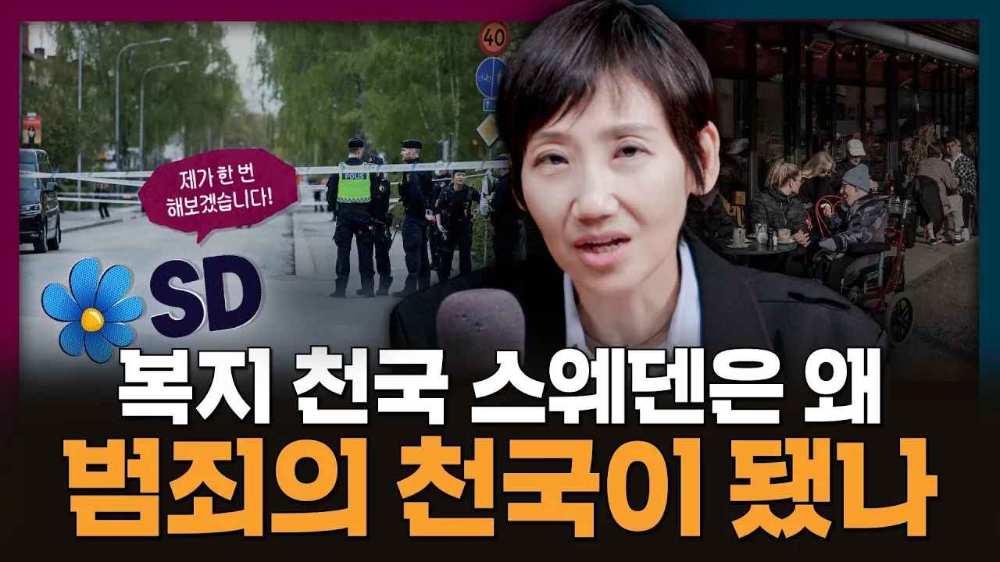

# 복지 천국 스웨덴은 어쩌다 범죄의 천국이 되었을까 | 스웨덴, 총선, 이민

## 기본 정보
- **URL**: https://www.youtube.com/watch?v=qpsPEK3OdBo
- **채널명**: 김지윤의 지식Play
- **구독자수**: 139만
- **조회수**: 1,049,877
- **업로드일**: 2026-09-27
- **영상 길이**: 14:46
- **댓글 수**: 614
- **좋아요 수**: 6,576

## 썸네일

---

## 댓글 (추천순 TOP 10)

| 순위 | 좋아요 | 댓글 |
|------|--------|------|
| 1 | 174 | 12:45 2022년 -> 2026년 자막 오타입니다! 편집하면서 여러번 봤는데 저 큰 텍스트를 어쩌다 그냥 지나쳤을까요…  다음부터는 더 꼼꼼하게 검수하도록하겠습니다! - 지식play PD |
| 2 | 2 | 김지윤교수 분은  최근 영상 같은데... 얼굴 부터 신체 많이 야윈 부분이... 근력은 사람이 살아가는 모든 부분 중 하나죠 항상 건강하시고 좋은 후배 양성에 모쪼록 힘써 주세요 ^^* 뭉충이들이야 뭐...😅 |
| 3 | 1 | 이전 방송 재업인가 순간 놀랐습니다^^:;; |
| 4 | 0 | 네 숫자는 더욱 잘 살펴주세요 감사합니다 |
| 5 | 4 | 보고 2시간전 영상인데 하고 년도가 안맞아서 놀랐네요 ^^ |
| 6 | 685 | 이민자는 진짜 심각하게 생각해야함. 노동자로 일해서 돈벌고 다시 돌아가는 정책이 맞다고 본다 |
| 7 | 15 | 서양사회보다 이민자가 적으니 우린 만족해야된다는 건 복종주의임. 우리가 너무 많다고 생각하면 한명도 많은 거임. 그 결정권이 우리 권리임. 그리고 적정선 같은거 없슴. 우리 인구밀도 중국의 3.5배, 미국의 15배임. 좁은 땅에 사람 ㅈㄹ많은거. 인구 소멸이니 어쩌구 이민 보편화 시킬려구 작업치는 거임 |
| 8 | 0 | 미국은 이민자를 엄청 빡세게 필터링 해서 받음. 조건도 엄청 까다롭고. 여기서 이야기하는 이민자와는 결이 다름 |
| 9 | 0 |  @Heyyousleepwell  이 댓글도 여기서 하는 예기와 결이 다름 |
| 10 | 52 | 우리 나라도 정치인들이 저출산 해결 한답시고 중국인이나 동남아나 난민 질 안 좋은 애들 마구 받는 거 막아야 함. 그에 따른 범죄 증가하면 또 그거 고치겠다고 온 국민 통제 검열할 거 아님? 그냥 애초부터 해서는 안되는 짓거리임. 지금도 cctv니 안면인식이니 과한데  저출산 막겠다는 명분으로 이민자들 다수 받아서 치안 악화 되면 또 그 명분으로 공권력 강화 통제 검열. 이게 공산주의 가는 과정이지 뭐임. 이런 짓거리는 해서는 안됨. |
