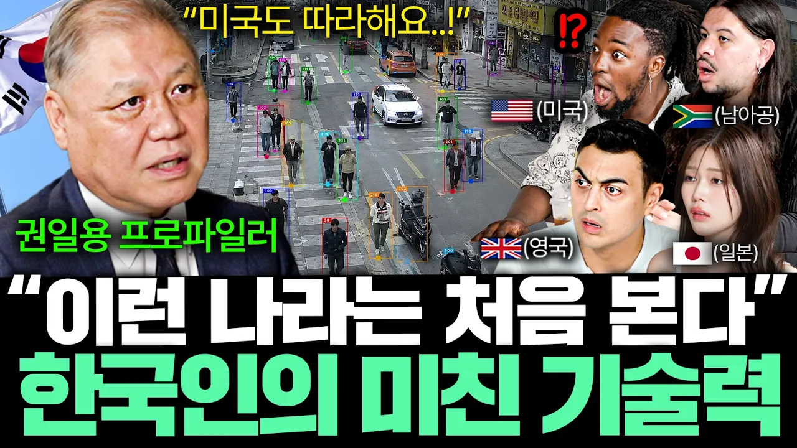

# "한국은 세계 최고 수준" 한국에서는 완벽범죄가 일어나지 않는 진짜 이유 l 국경없는 클래스 EP.26 (권일용 프로파일러)

## 기본 정보
- **URL**: https://www.youtube.com/watch?v=Arpb9vcC1U4
- **채널명**: 어썸코리아 Awesome Korea
- **구독자수**: 130만
- **조회수**: 780,235
- **업로드일**: 2026-07-29
- **영상 길이**: 36:09
- **댓글 수**: 810
- **좋아요 수**: 14,367

## 썸네일

---

## 댓글 (추천순 TOP 10)

| 순위 | 좋아요 | 댓글 |
|------|--------|------|
| 1 | 1,000 | 기깔난 첨단기법으로 범인 잡음 뭐하냐고 형량은 아주 후진대 |
| 2 | 39 | 판사 가족들이 강력범죄 당해봐야 함 |
| 3 | 19 | ​ @yejinsun2 제가 항상 생각하는게 이거예요 |
| 4 | 86 | 판사들 싹 갈아 엎고 법 쳬게도 다 뜯어 고쳐야 합니다.. 범죄자들에 대해서 너무 후한 나라임.. |
| 5 | 53 | ​ @모두다힘내  법체계는 문제 없어요. 최저와 최고 다 있지만 판사들이 보복이 두려운지 최저만 때려요. 죽은 사람은 안두렵지만 살아있는 범죄자는 두려운가죠. 무엇보다 사형 집행을 안하니까 선고라도 해야하는데 사형 선고조차 꺼려해서 사람 죽여도 사형선고 안나옵니다. 결론은 법이 문제가 아니라 판사가 문제에요. |
| 6 | 16 | 정치이슈로 싸울때는 다른 나라는 이렇지 않느냐 저렇지 않느냐 잘도 따지더만 형량을 비교하는건 본 적이 없음. |
| 7 | 64 | 이게 제일 문제임.. |
| 8 | 12 | 이게 문제네요 |
| 9 | 10 | 국회와 사법부가 가 여러가지로 국가의 발목을 잡네요. 범인을 잡으면 이에 맞게 형량을 안겨줘야하는데 정의를 위해 일하지않고 사리사욕만 챙기는 기생충짓들이나 하니! |
| 10 | 7 | 그래도 노력해야죠!!!! 점점 더 바뀔거라고 희망을 가지고. 특히나 성범죄!!!!!!! |
