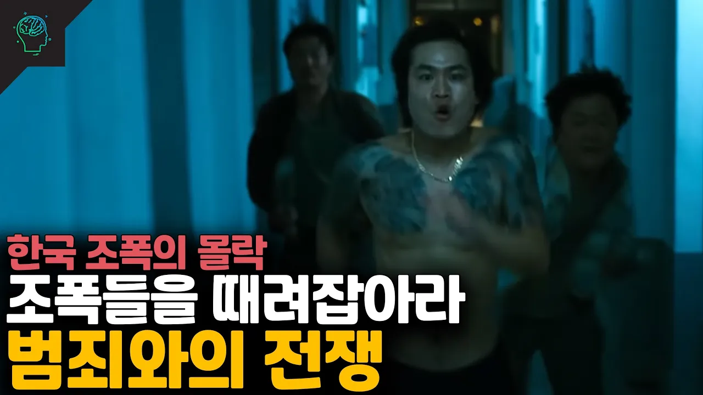

# 한국의 치안이 좋은 이유 '조폭들의 몰락 범죄와의 전쟁'(노태우 10.13특별선언)

## 기본 정보
- **URL**: https://www.youtube.com/watch?v=lpcs60buh6g
- **채널명**: 당신이 몰랐던 이야기
- **구독자수**: 133만
- **조회수**: 443,239
- **업로드일**: 2022-09-17
- **영상 길이**: 11:23
- **댓글 수**: 647
- **좋아요 수**: 4,493

## 썸네일

---

## 댓글 (추천순 TOP 10)

| 순위 | 좋아요 | 댓글 |
|------|--------|------|
| 1 | 44 | 도쿠 채널 다큐멘터리 출연 문의 : pajuhoakeorj@naver.com
 
 당신이 몰랐던 이야기 : https://url.kr/i8fxjq
 
 스튜디오 채널 도쿠[DOCU] : https://bit.ly/3ADnVg2
 
 당몰이 미스테리 채널 : https://url.kr/m89t6j
 
 랭킹 스토리 채널 : https://bit.ly/3qzfP4B
 
 유돈노 스토리 채널 : https://bit.ly/3DIeprz |
| 2 | 871 | 솔직히 좌우로 야쿠자, 삼합회가 있는데 우리나라는 비교적 대형 범죄조직이 형성되지 못했으니 이건 참 좋은듯 |
| 3 | 215 | 형성되었었는데, 국가에서 "범죄와의 전쟁"을 선포하고 경찰 형사,총 동원해서 소탕한 결과일 뿐입니다 하지 않았다면 지금 타국들 처럼 존재하고 국가의 악의적부분으로 좀먹고 있었겠죠 |
| 4 | 10 |  @알라후아크바르-z1y  이로 인해 흩어진 잔당 조폭들이 각종 종교단체, 시민단체, 노조로 들어가 전문 시위꾼이나 사이비 목사 등으로 전직했죠. |
| 5 | 10 | 성남조폭이랑 손잡은 정치인 밑에서 살 뻔했다 ㄷㄷㄷ |
| 6 | 3 | ​ @sunsun537  그렇게됨 |
| 7 | 59 | 박통 전통 노통이 잘한게 거이 10년주기로 깡패 소탕한거다 물론 전통시절 성과에 의한 억울한 분들도있는데 60년부터 90년대까지 클려고 하면 잡고해서 울나라가 이정도지ㅋ 아님 다른나라처럼 손도못쓴다 |
| 8 | 2 |  @kingking-dm2jp  조폭은 반대하지만 미국처럼 정부를 견제할 민병대는 찬성. |
| 9 | 62 |  @Bangtang_Aje  민병대까지 왜나옴?주제에  어긋나고 민병대잇음 국가내분이 일어남 ㅋㅋ견제한다하고 지들끼리밥싸움해요 ㅋ |
| 10 | 0 |  @kingking-dm2jp  그게 내가 원하는거 ㅋㅋㅋ |
