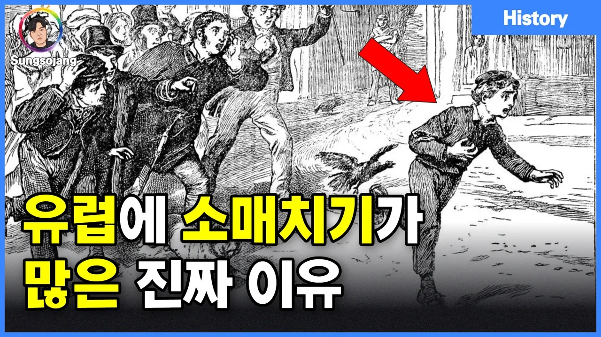

# 유럽에 소매치기가 유독 많은 진짜 이유 (ft. 한국 치안)

## 기본 정보
- **URL**: https://www.youtube.com/watch?v=xxJlcKk2wMY
- **채널명**: Sungsojang
- **구독자수**: 3만
- **조회수**: 101,975
- **업로드일**: 2025-03-01
- **영상 길이**: 5:55
- **댓글 수**: 326
- **좋아요 수**: 1,862

## 썸네일

---

## 댓글 (추천순 TOP 10)

| 순위 | 좋아요 | 댓글 |
|------|--------|------|
| 1 | 283 | 우리나라는 소매치기는 없어도 사기는 세계1등. |
| 2 | 28 | ㄹㅇ 대한민국 사기도 처벌수위가 낮아서 그럼 ㅋ 100억사기쳐도 깜방5년이면 개꿀 |
| 3 | 22 | 조선족 목소리의 보이스 피싱 유명하죠 |
| 4 | 2 | 흔한사기범죄 = 채무불이행 |
| 5 | 1 | ㅋㅋㅋㅋ 절대 공감 |
| 6 | 1 | 대통령이 되기 위해선 사기능력이 필수임. |
| 7 | 0 | 법을 다루는 애들이 다 사기꾼이거든 |
| 8 | 7 | 카드 사용 이후 현금을 가지고 다니는 비율이 낮아져서 소매치기할 현금이 없어 그런 듯 . |
| 9 | 2 | 우리나라는 경찰이 법보다 위에 있기때문에 소매치기도 감옥감 |
| 10 | 1 | 넓은 타국에 비하면 우리나라도 사기범죄가 많은것도 아니지 |
