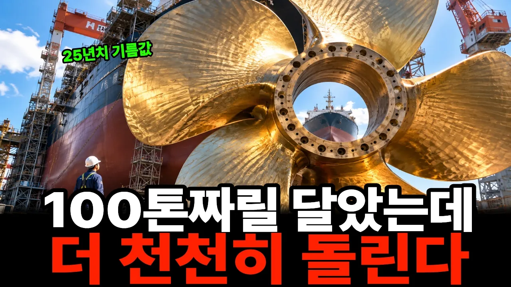

# “100톤짜리를 달아놓고 일부러 천천히 돌립니다” 울산 프로펠러가 비싸지는 진짜 이유

## 기본 정보
- **URL**: https://www.youtube.com/watch?v=l88OHRMG0EY
- **채널명**: 탁경제
- **구독자수**: 2,120
- **조회수**: 134,320
- **업로드일**: 2026-09-28
- **영상 길이**: 20:31
- **댓글 수**: 28
- **좋아요 수**: 465

## 썸네일

---

## 댓글 (추천순 TOP 10)

| 순위 | 좋아요 | 댓글 |
|------|--------|------|
| 1 | 6 | 프로펠러 값은 십수억 원인데, 배 한 척은 한 해에도 수백억 원의 기름을 태웁니다.  그러니 선주가 100톤 무게보다 몇 퍼센트의 차이에 민감한 이유가 있겠죠.  여러분이 선주라면 가장 먼저 뭘 보실 것 같으신가요?😊 |
| 2 | 9 | 선박에 추진력을 제공하는 장치의 명칭은 프로펠러가 아니라 스크류. |
| 3 | 3 | 맞습니다. 영상에서도 ‘스크루’라는 표현을 한 번 언급하긴 했는데, 본문에서는 시청자분들이 더 익숙하게 들으실 수 있게 ‘프로펠러’로 풀어 썼습니다. 말씀하신 표현이 더 정확하죠. 한 번 더 짚어주셔서 감사합니다 😊 |
| 4 | 3 | ❤그렇군요😊😊 |
| 5 | 1 | 안녕하세요. 댓글 감사합니다.😍 |
| 6 | 2 | 매번 영상으로만 보다보니 실제 대형 선박을 한 번 눈으로 보고 싶네요😊 |
| 7 | 1 | 저도 꼭 한번 가까이서 보고 싶습니다😊 부산항은 가보았는데..울산 가시면 울산대교 전망대에서 조선소와 대형 선박을 한번 보셔도 좋을 것 같아요. 화면에서 보던 것과 규모감이 완전히 다를 듯합니다.👍 |
| 8 | 1 | 거제오면 매일 볼 수 있어요 |
| 9 | 1 | 거제 정말 좋아합니다.거제에 계신 분들에겐 그 거대한 배와 조선소 풍경이 일상이겠군요. 부럽습니다😊 |
| 10 | 2 | 거대한 자연이나 거대한 물체 앞에 서면 인간은 참 작은 존재라는 걸 느끼게 됩니다. 그런데 또 그런 거대한 것을 인간이 직접 만들어낸다는 사실을 보면, 인간이라는 존재가 참 묘하다는 생각도 드네요. |
