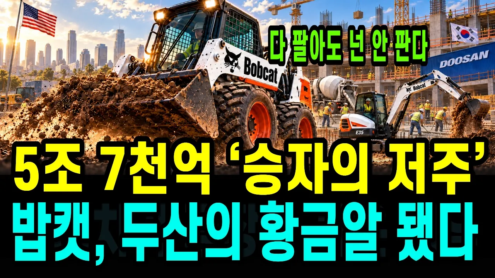

# 한국이 49억 달러에 산 미국 공장, 승자의 저주라던 15년 뒤 미국 공사장 로더 1위가 됐습니다 — 캐터필러·쿠보타를 앞에 두고

## 기본 정보
- **URL**: https://www.youtube.com/watch?v=nfHcHwfYQaM
- **채널명**: 경제솔로몬
- **구독자수**: 4,420
- **조회수**: 100,324
- **업로드일**: 2026-09-29
- **영상 길이**: 25:39
- **댓글 수**: 27
- **좋아요 수**: 705

## 썸네일

---

## 댓글 (추천순 TOP 10)

| 순위 | 좋아요 | 댓글 |
|------|--------|------|
| 1 | 1 | 굿. 잘 배웠습니다.  그 결단의 순간에 저라면 그렇게 뚝심있게 못했을겁니다.  박용만회장님 승! |
| 2 | 0 | 그쵸 ㅎㅎ 시장이 무너지는 상황에서 버텨낸 게 쉬운 결정이 아니었을 텐데, 결과적으로 뚝심이 빛났네요! |
| 3 | 2 | 2009년, 주가는 이틀 연속 하한가에 3년 적자만 1조 2,000억 원이었습니다. 여러분이 그 자리에 앉아 있었다면, 손실을 끊고 되파셨겠습니까, 빚을 더 내서라도 버티셨겠습니까? |
| 4 | 1 | 솔직히 저라면 무조건 팔았을 것 같아요 ㅋㅋㅋ 근데 그게 틀린 선택이 됐겠죠 😅 버틴 사람들이 결국 역사를 만든다는 게 참 무서운 것 같습니다! |
| 5 | 1 | 살아남는데 최선을 다하셔서 새시대를 맞이했즈요. 과욕은 금물 아무리 자본따라해도 일산 두산 건물은 상상이상이지요. 앞으로도 건건솔은 회사건설에 주을 두고 사업하세요. 내 몸이 건강해야  사회도 건강하게 보입니다.과한 탐욕은 화를 부릅니다  이제는 물건이 넉넉하고 그들과 도래하면 꼭 배신은 안함. 앞으로도 려욕할 사업체들 더 필요하면 요구하세요. 어떤 분야든. ❤ |
| 6 | 3 | 계차도 하나 더 필요합니다  하하 요구도 큰 결단이 필요함 나 여지에서 빠져 나가야합니다. 나중에 몰러서 헤매지 안기 해드리는 것임 증평 용강에 들어와 있는게 잘못이지 나는 방법 다 있음. ❤ 그냥 아님 다 해주고 받는 것임 ❤ |
| 7 | 1 | 모든 일이 잘 풀리길 응원합니다 ㅎㅎ! |
| 8 | 0 | 두산중공업 - 두산인프라코어 -  두산밥캣 |
| 9 | 0 | 이름이 바뀔 때마다 회사의 무게중심도 같이 이동했죠 ㅎㅎ 결국 밥캣이 핵심이 된 흐름이 참 흥미롭습니다! |
| 10 | 0 | 수업은언제부터인가요 |
