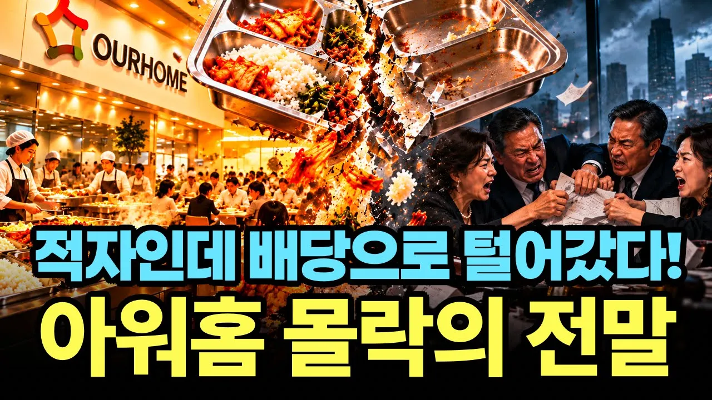

# 아워홈 "감히 내 앞을 끼어들어" 강남 보복운전으로 날아간 황태자의 자리

## 기본 정보
- **URL**: https://www.youtube.com/watch?v=tteeaYs8iww
- **채널명**: 경제꽈배기
- **구독자수**: 1,020
- **조회수**: 89,496
- **업로드일**: 2026-09-25
- **영상 길이**: 15:17
- **댓글 수**: 43
- **좋아요 수**: 211

## 썸네일

---

## 댓글 (추천순 TOP 10)

| 순위 | 좋아요 | 댓글 |
|------|--------|------|
| 1 | 24 | 땅집고 헤엄친 회사인데 망하는게 당연.  LG그룹내 식당들을 갑자기 몰아줘 만든 구씨 집안 회사. |
| 2 | 16 | 가만히 경영만 해도 잘될 급식회사를 구자학 자식들의 분열싸움으로 망조가들고  급식회사 인수한 한화만 개꿀 재미를 보네. |
| 3 | 13 | LG에 저런 놈들도 있었구나.... |
| 4 | 3 | 한화로 넘어간 후 음식 질, 양이 좋아짐.. |
| 5 | 8 | 한심한 집안이구만...........ㅠㅠㅠㅠㅠㅠㅠㅠㅠ 하나 손해 보고 말지....싸워야 하냐 |
| 6 | 0 | 속상하실 것 같아요. 다음엔 더 나은 소식으로 찾아뵙겠습니다. |
| 7 | 7 | 전관예우로 감방살이 면했네.. |
| 8 | 4 | 그래서 설/추석때 강제로나오던 수향식품이 안나오는거구나.. |
| 9 | 0 | 확실히 예전엔 명절마다 자주 보이던 모습이었는데, 요즘은 많이 달라졌더라고요. |
| 10 | 0 | 가족 회사내 |
